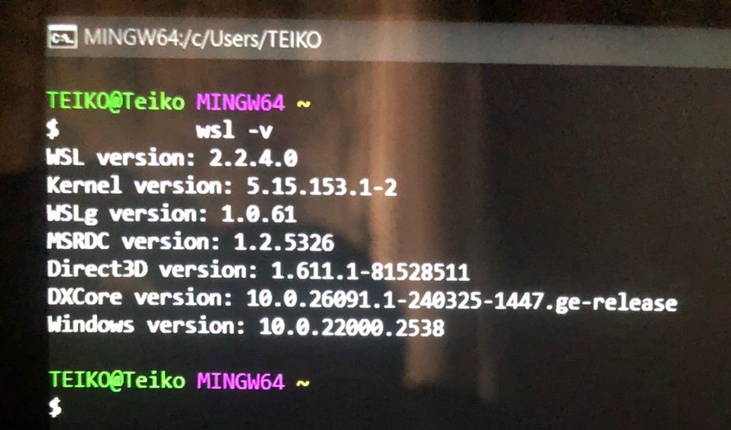
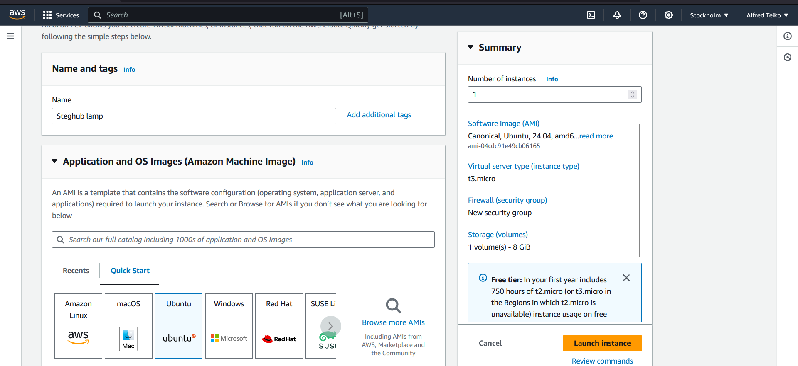
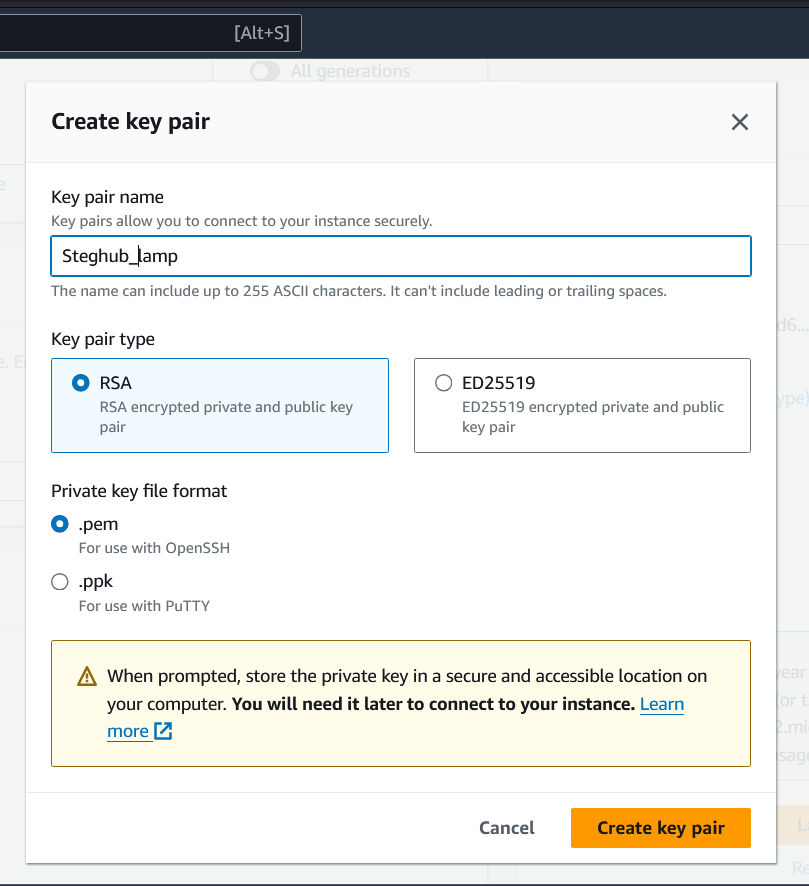

# WEB STACK IMPLEMENTATION (LAMP STACK) IN AWS

# STEP 0 - Prerequisite installation
# Steps to Install Ubuntu on Windows Using WSL

 Enable Windows Subsystem for Linux:
 Open PowerShell as an administrator/ Install git and open gitbash.
 Run the command:
 
    wsl -v

 If you don't have it installed use this command

    wsl --install -d Ubuntu-20.04



# Steps to Launch an EC2 Instance on AWS Using Ubuntu

1. Log into AWS Management Console:
   - Go to the [AWS Management Console](https://aws.amazon.com/console/) and log in with your credentials.

2. Navigate to EC2 Dashboard:
   - In the console, search for EC2 in the services search bar and select EC2.

3. Launch Instance:
   - Click on the **“Launch Instance”** button.

4. Choose an Amazon Machine Image (AMI):
   - Select an Ubuntu AMI from the list (e.g., Ubuntu Server 22.04 LTS).

   

5. Choose an Instance Type:
   - Select the instance type (e.g., `t2.micro` for the free tier) and click **“Next: Configure Instance Details.”**

6. Configure Instance Details:
   - Adjust any necessary settings (e.g., number of instances, VPC, etc.) and click **“Next: Add Storage.”**

8. Configure Security Group:
   - Create a new security group or select an existing one. Ensure to allow SSH (port 22) access from your IP address.

10. Review and Launch:
    - Review your instance configuration and click **“Launch.”**

11. Select or Create Key Pair:
    - Choose an existing key pair or create a new one. Download the key pair (.pem file) and keep it safe.

     

12. Launch Instance:
    - Click **“Launch Instances.”** Wait a moment for the instance to start.
    
     

14. Change permission or instance using:
    sudo chmod 400 <private-key-name>.pem / pem file path

13. Connect to Your Instance:
    - Use an SSH client to connect:
      ```bash
      ssh -i /path/to/your-key.pem ubuntu@your-public-dns-name
      ```
