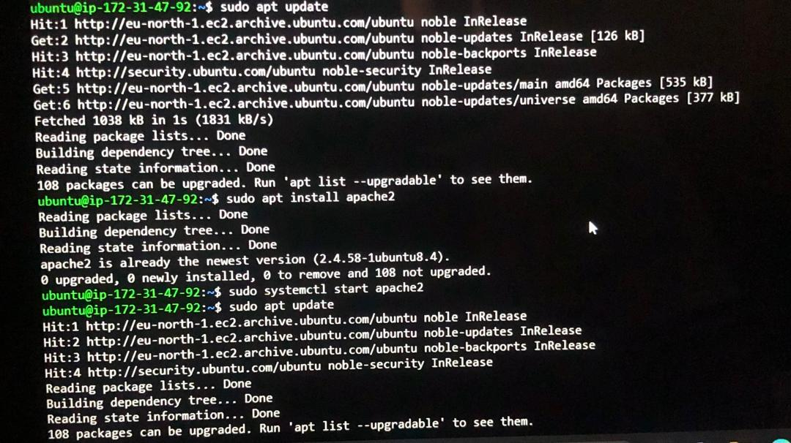
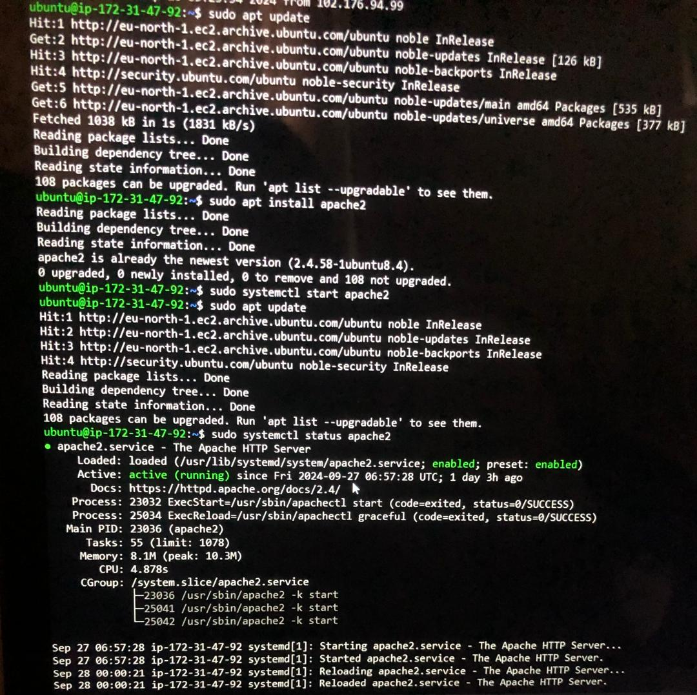
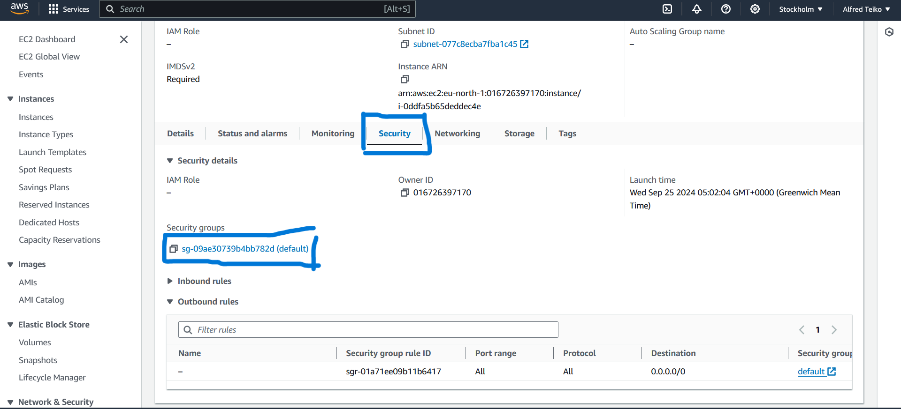
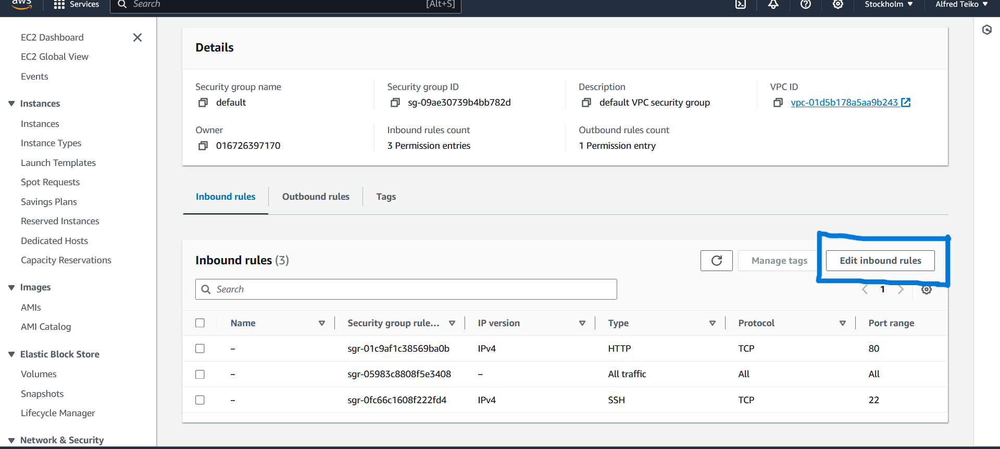
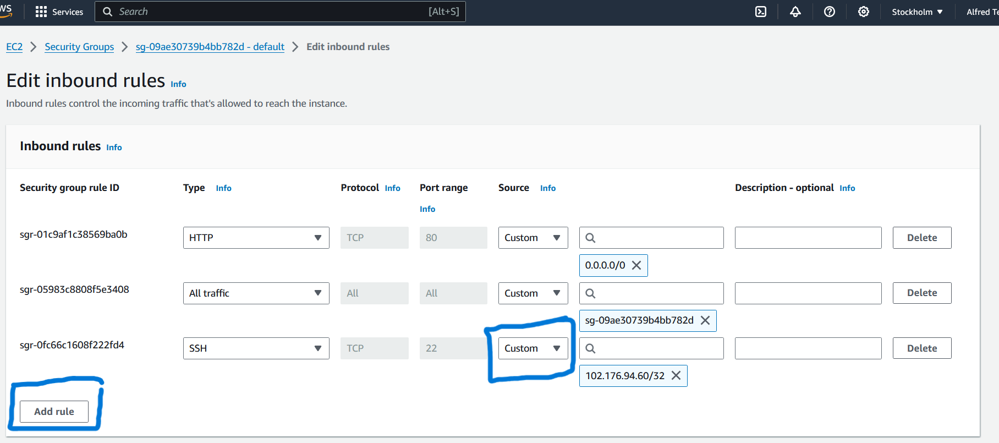
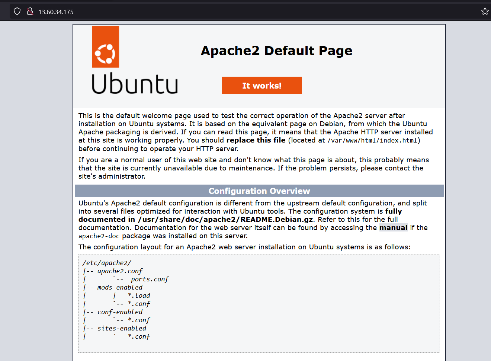

# STEP 1 - Installing Apache & Updating the Firewall.
To install apache use these commands:

# Update a list of packages in package manager

     $ sudo apt update

# Run apache2 package installation:

      $ sudo apt install apache2 -y

# Verify the apache is running in your OS by entering the command below
     $ sudo systemctl status apache2

# To add a rule to allow EC2 to access it via SSH:
1. View the Security Group:
- Scroll down in the instance details and find the Security Groups section.
- Click on the Security Group linked to your EC2 instance.

    

2. Edit Inbound Rules:
- In the Security Group details page, click on the Inbound Rules tab.

- Click the Edit Inbound Rules button.

    

3. Add SSH Rule:
- In the inbound rules section, click Add Rule.
  - Set the following:
   - Type: Select SSH.
   - Protocol: This will automatically set to TCP.
   - Port Range: 22 (default for SSH).
   - Source: Set to your choice (e.g., My IP to allow access only from your IP, or Anywhere for public access)

    

4. Request our Apache HTTP Server on port 80 using this command:

     $ curl http://localhost:80

# Run the Apache HTTP server in your browser using the Ip address of your instance

     http://<Publich-IP-Address>

