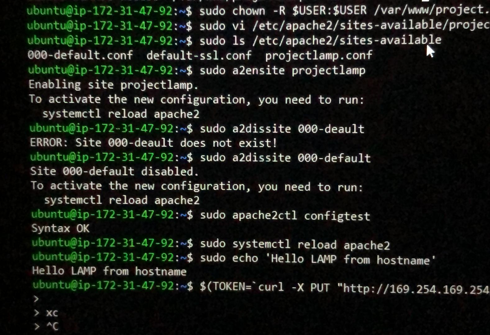

# STEP 4 - Craeting a Virtual Host for your Website using Apache
1. Create the directory or project lamp using:
     $ sudo mkdir /var/www/projectlamp

2. Assign Ownership to directory using:
     $ sudo chown -R $USER / var/www/projectlamp

3. Craete and Open new coniguration ile in Apache using vi command editor:
     $ sudo vi/etc/apache2/sites-available/projectlamp.conf

4. Paste the ollowing coniguration by hitting i on the keyboard:
```
 <VirtualHost *:80>
    ServerName projectlamp
    ServerAlias www.projectlamp
    ServerAdmin webmaster@localhost
    DocumentRoot /var/www/project.lamp
    ErrorLog ${APACHE_LOG_DIR}/error.log
    CustomLog ${APACHE_LOG_DIR}/access.log combined
</VirtualHost> 
```

To save;
1. Hit the esc button on the keyboard
2. Type:
3. Type wq and enter to exit

5. To enable new virtual host use:
     sudo a2ensite projectlamp


6. To disable Apache's deault website use:
     sudo a2dissite 000-deault

7. MAke sure your configuration ile doe not contain syntax error using:
     sudo apache2ctl conigtest

8. Reload Apache using:
     sudo systemctl reload apache2

9. Create an index.html file in the new webiste using:
``` 
 TOKEN=$(curl -X PUT "http://169.254.169.254/latest/api/token" -H "X-aws-ec2-metadata-token-ttl-seconds: 21600")
 PUBLIC_HOSTNAME=$(curl -H "X-aws-ec2-metadata-token: $TOKEN" -s http://169.254.169.254/latest/meta-data/public-hostname)
 PUBLIC_IP=$(curl -H "X-aws-ec2-metadata-token: $TOKEN" -s http://169.254.169.254/latest/meta-data/public-ipv4) 

 echo "Hello LAMP from hostname $PUBLIC_HOSTNAME with public IP $PUBLIC_IP" 
 ```

10. Open your website URL usiong IP address:
     http;//<Public-IP-Address>:80


