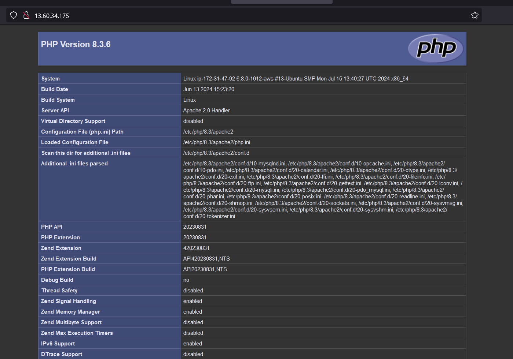

# STEP 5 - Enable PHP on the website
1. To change Order in which the index.php file is listed within the DirectoryIndex directive:
```
sudo vim /etc/apache2/mods-enabled/dir.conf
```

```
<IfModule mod_dir.c>
        #change this:
        #DirectoryIndex index.html index.cgi index.pl index.php index.xhtml index.htm
        #To this:
        DirectoryIndex index.php index.html index.cgi index.pl index.xhtml index.htm
<IfModule>
```

2. To exit the vi editor
Press Esc on the keyboard
Type ":wq" then enter

3. Reload Apachw with:
```
sudo systemctl reload apache2
```

4. Create a new file named index.php inside your custom web root folder:
```
vim /var/www/projectlamp/index.php
```
5. Add the valid PHP code:
```
<?php
phpinfo();
```



6. Since the info displayed contain sensitive information remove file by:
```
sudo rm /var/www/proectlamp/index.php
```
