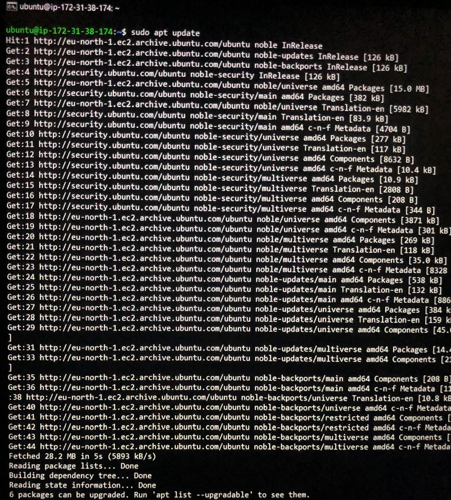
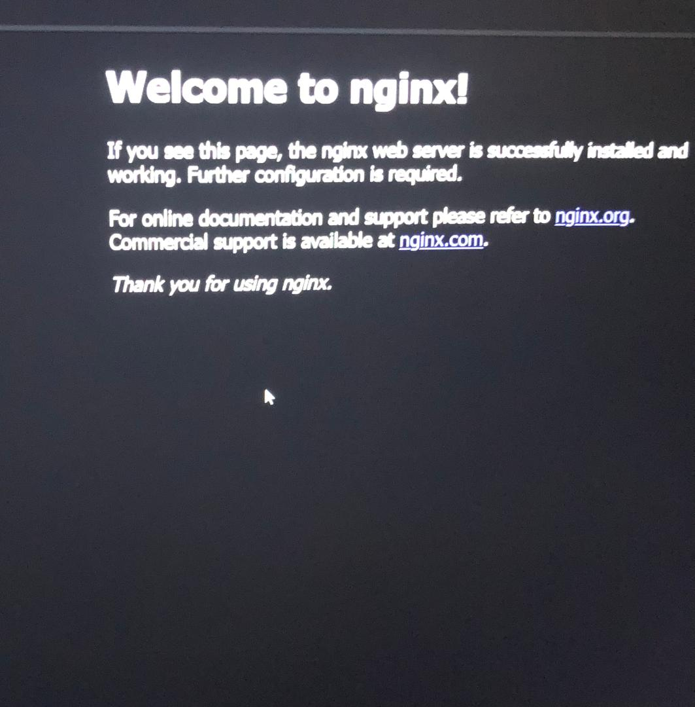

# WEB STACK IMPLEMENTATION (LEMP STACK) IN AWS

# STEP 1 - Installing the Nginx Web Server
1. We'll use the apt to get Nginx installed:
```
$ sudo apt update
$ sudo apt install nginx
```



2. Check for successful installation of Nginx as a service in Ubuntu :
```
$ sudo systemctl status nginx
```


3. Since TCP port 22 is open by deaulft on our EC2 machine to access it via SSH, we need to add a rule to EC2 configuration to open inbound connection through port 80.

4. To check the Nginx and access it locally in our Ubuntu shell run:
```
$ curl http://localhost:80
```

5. To check if Nginx server can respond to requests from the internet:
```
http://<Public-IP-Address>:80
```

