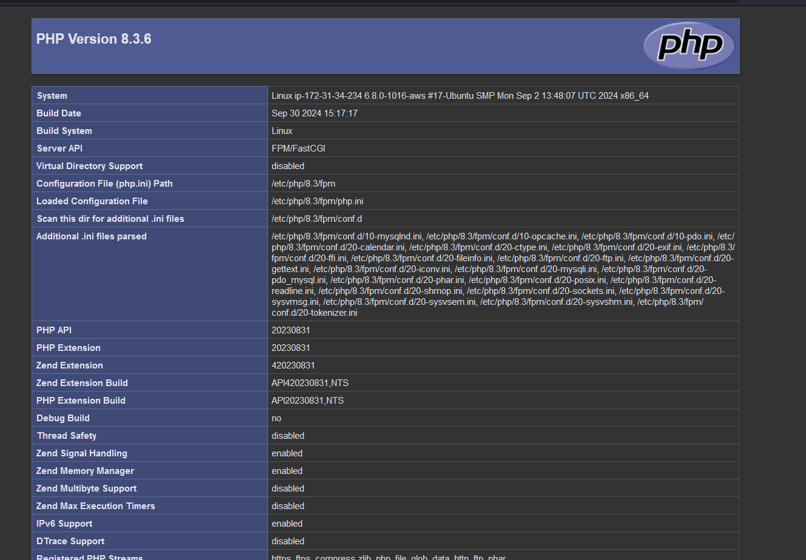

# WEB STACK IMPLEMENTATION (LEMP STACK) IN AWS

# STEP 5 - Testing PHP with Nginx
1. Test PHP file in your document root using by opening new file called info.php:
```
$ nano /var/www/projectLEMP/info.php
```

2. Return PHP code using:
```
<?php
phpinfo();
```

3. Access the page in your web browser using:
```
http://`server_domain_or_IP`/info.php
```


4. Remove file because it contains sensitive information using:
```
$ sudo rm /var/www/your_domain/info.php
```


