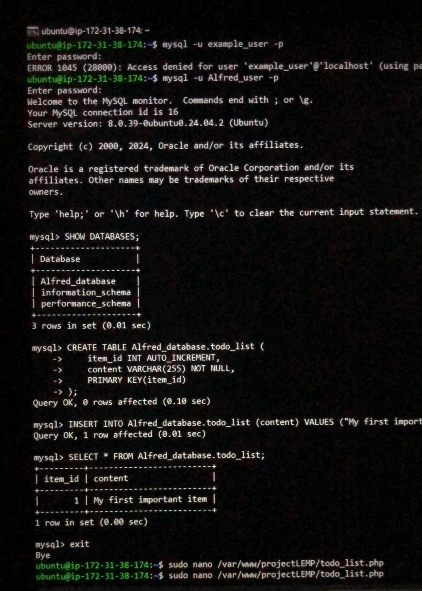
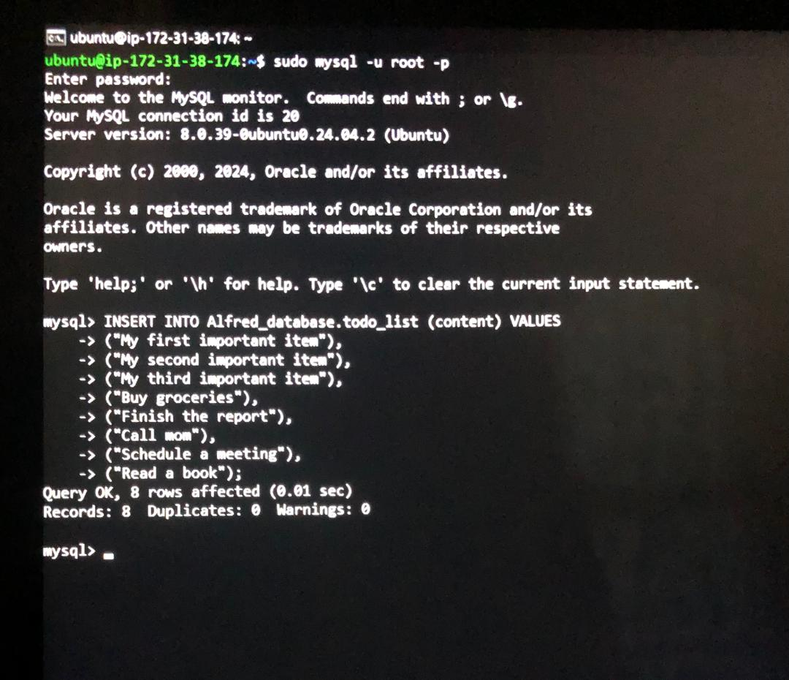
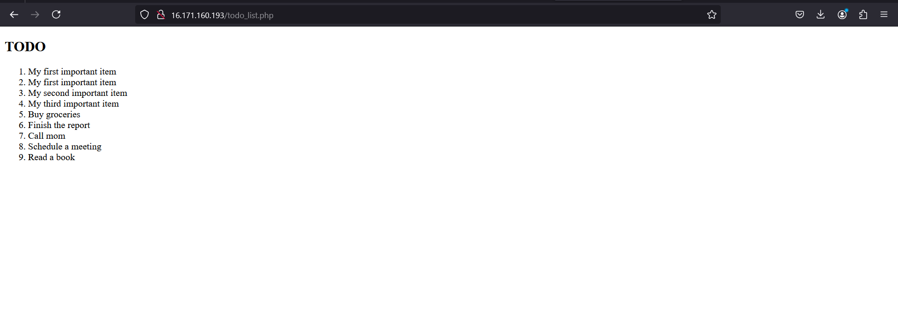

# WEB STACK IMPLEMENTATION (LEMP STACK) IN AWS

# STEP 6 - Retrieving data from MySQL database with PHP
1. Connect to MySQL console using root account:
```
$ sudo mysql
```

2. Create a new database using:
```
CREATE DATABASE `example_database`;
```

3. Create a new user using your prefered credentials:
```
CREATE USER 'example_user'@'%' IDENTIFIED WITH mysql_native_password BY 'PassWord.1';
```

4. Grant user permission over the database using:
```
GRANT ALL PRIVILEGES ON example_database.* TO 'example_user'@'%';
```

5. Exit MySQl shell using:
```
exit
```

6. Test if user has the proper permission by logging in to the MYSQL console again using:
```
$ mysql -u example_user -p
```

7. To conirm you have access to the database type:
```
SHOW DATABASES;
```

8. To create a test table named todo_list, run:
```
CREATE TABLE Alfred_database.todo_list (
    item_id INT AUTO_INCREMENT,
    content VARCHAR(255) NOT NULL,
    PRIMARY KEY(item_id)
);

```

9. Insert a few rows of content in the test table using:
```
INSERT INTO example_database.todo_list (content) VALUE ("My first important item");
```

10. To confirm that the data was successfully saved to table, run:
```
SELECT * FROM example_database.todo_list;
```

11. To exit from MYSQL shell run:
```
exit
```



12. Create a PHP script that will connect to MySQL and query for your content.
```
$ nano /var/www/projectLEMP/todo_list.php
```

13. Paste the content to connect to the MySQL database queries for the content o the todo_list and save:
```
<?php
$user = "example_user";
$password = "PassWord.1";
$database = "example_database";
$table = "todo_list";

try {
  $db = new PDO("mysql:host=localhost;dbname=$database", $user, $password);
  echo "<h2>TODO</h2><ol>";
  foreach ($db->query("SELECT content FROM $table") as $row) {
    echo "<li>" . $row['content'] . "</li>";
  }
  echo "</ol>";
} catch (PDOException $e) {
    print "Error!: " . $e->getMessage() . "<br/>";
    die();

}
```

14. Added more data to our todolist by:
```
INSERT INTO Alfred_database.todo_list (content) VALUES
    -> ("My first important item"),
    -> ("My second important item"),
    -> ("My third important item"),
    -> ("Buy groceries"),
    -> ("Finish the report"),
    -> ("Call mom"),
    -> ("Schedule a meeting"),
    -> ("Read a book");
```



15. To access page on web browser, visit:
```
http://<Public_domain_or_IP>/todo_list.php
```

