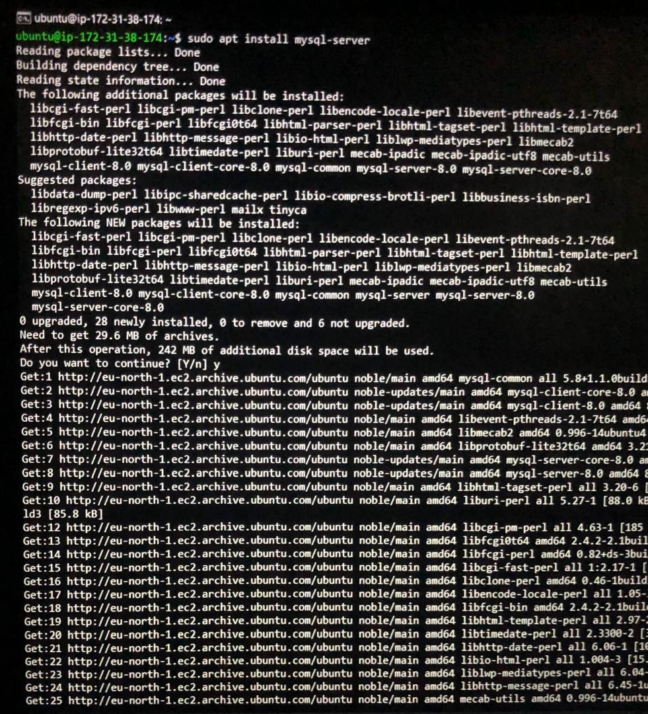
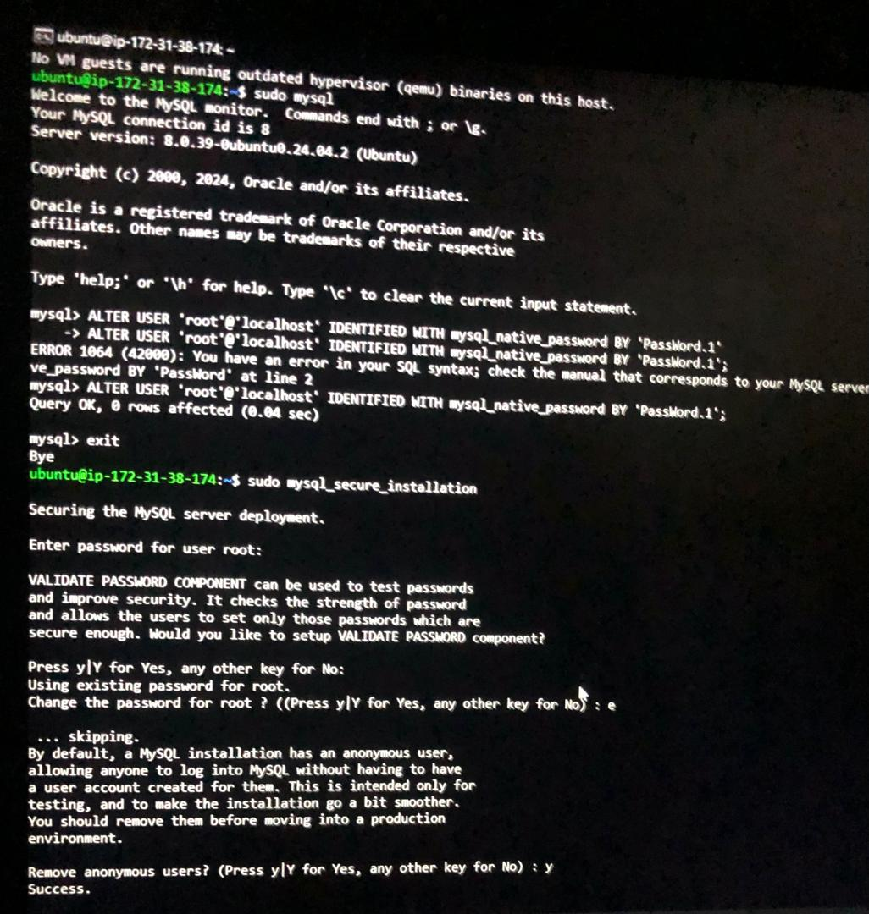
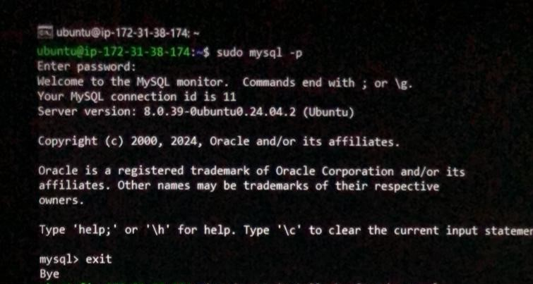

# WEB STACK IMPLEMENTATION (LEMP STACK) IN AWS

# STEP 3 - Installing MYSQL
1. To acquire and install Mysql:
```
$ sudo apt install mysql-server
```



2. Log in to the MYSQL console using:
```
$ sudo mysql
```


MySQL server as the dministrative database will display:

3. Define default authentication and user's password using:
```
ALTER USER 'root'@'localhost' IDENTIFIED WITH mysql_native_password BY 'PassWord.1';
```

4. Exit mysql shell with:
```
exit
```

5. Start the interactive script by running:
```
$ sudo mysql_secure_installation
```



6. Set a password or leave validation disabled, but you should always use strong, unique passwords. Press y or follow any other prompt.

7. Test if you're able to log in to the MYSQL console using:
```
$ sudo mysql -p
```

8. To exit the MYSQL console type:
```
exit
```

