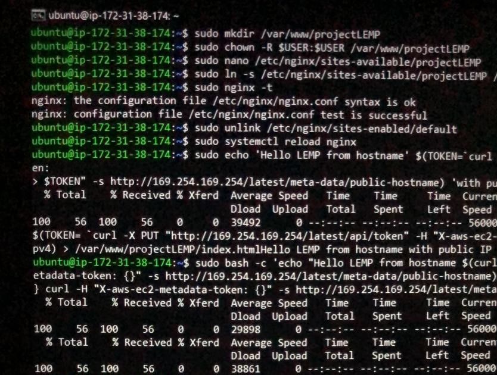
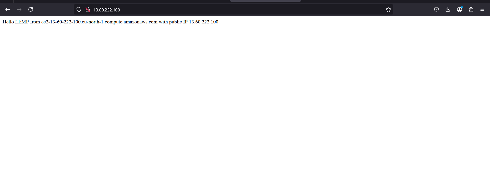

# WEB STACK IMPLEMENTATION (LEMP STACK) IN AWS

# STEP 4 - Configuring Nginx to Use PHP Processor
1. Create a root web directory of your_domain using:
```
$ sudo mkdir /var/www/projectLEMP
```

2. Assign ownership of the directory with the $USER environment variable:
```
$ sudo chown -R $USER:$USER /var/www/projectLEMP
```

3. To open a new configuration file in Nginx's sites available directory using nano editor:
```
$ sudo nano /etc/nginx/sites-available/projectLEMP
```

4. Paste in the following coniguration:
```
#/etc/nginx/sites-availble/projectLEMP

server {
    listen 80;
    server_name projectLEMP www.projectLEMP;
    root /var/www/projectLEMP;

    index index.html index.htm index.php;

    location / {
       try_files $uri $uri/ =404;
    }

    location ~ \.php$ {
        include snippets/fastcgi-php.conf;
        fastcgi_pass unix:/var/run/php/php8.3-fpm.sock;
     }

     location ~ /\.ht {
        deny all;
     }

}
```

5. Activate the coniguration by linking to the conig ile rom Nginx's sites-enabled directory:
```
$ sudo ln -s /etc/nginx/sites-available/projectLEMP /etc/nginx/sites-enabled/
```

6. Chcek for syntax errors using:
```
$ sudo nginx -t
```

7. Disable default Nginx host using:
```
sudo unlink /etc/nginx/sites-enabled/default
```

8. Reload Nginx to apply changes using:
```
sudo systemctl reload nginx
```




9. Create an index.html file in that location to test that new server block works as expected:
```
sudo echo 'Hello LEMP from hostname' $(TOKEN=`curl -X PUT "http://169.254.169.254/latest/api/token" -H "X-aws-ec2-metadata-token-ttl-seconds: 21600"` && curl -H "X-aws-ec2-metadata-token:
$TOKEN" -s http://169.254.169.254/latest/meta-data/public-hostname) 'with public IP'
$(TOKEN= `curl -X PUT "http://169.254.169.254/latest/api/token" -H "X-aws-ec2-metadata-token-ttl-seconds: 21600"` && curl -H "X-aws-ec2-metadata-token: $TOKEN" -s http://169.254.169.254/latest/meta-data/public-ipv4) > /var/www/projectLEMP/index.html
```

10. Open the website using IP address:
```
http://<Public-IP-Address>:80
```



