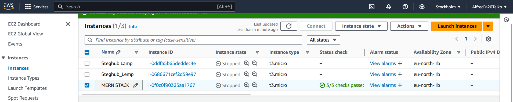
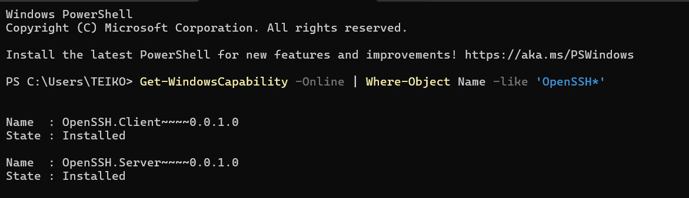
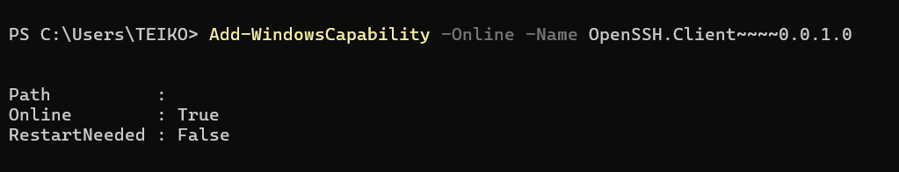
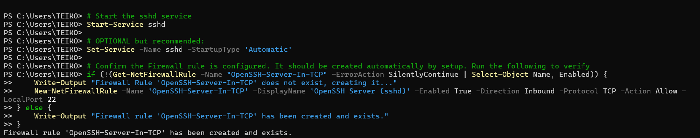

# MERN Web Stack

The MERN stack is a set of technologies used to build web applications. It includes four main tools:

MongoDB: A database where data is stored in a flexible, JSON-like format.
  
Express.js: A back-end web framework that helps manage server-side logic and handle HTTP requests.
  
React: A front-end library used to build user interfaces, especially for single-page applications.
  
Node.js: A platform that allows JavaScript to run on the server.

# STEP 0 - Prerequisite installation
1. Create an EC2 instance using your preferred name.



2. Install OpenSSH on windows using powershell, we run our Powershell as an Adminstrator.

3. To be sure that Open SSH is available run:

```
Get-WindowsCapability -Online | Where-Object Name -like 'OpenSSH*'
```



4. If not installed command should look like this or one present and the other not:

```
Name  : OpenSSH.Client~~~~0.0.1.0
State : NotPresent

Name  : OpenSSH.Server~~~~0.0.1.0
State : NotPresent
```

5. To install the server and client components run:

```
# Install the OpenSSH Client
Add-WindowsCapability -Online -Name OpenSSH.Client~~~~0.0.1.0

# Install the OpenSSH Server
Add-WindowsCapability -Online -Name OpenSSH.Server~~~~0.0.1.0
```

6. Both Command should return:



7. To start and conigure OpenSSH or initial use, run:

```
# Start the sshd service
Start-Service sshd

# OPTIONAL but recommended:
Set-Service -Name sshd -StartupType 'Automatic'

# Confirm the Firewall rule is configured. It should be created automatically by setup. Run the following to verify
if (!(Get-NetFirewallRule -Name "OpenSSH-Server-In-TCP" -ErrorAction SilentlyContinue | Select-Object Name, Enabled)) {
    Write-Output "Firewall Rule 'OpenSSH-Server-In-TCP' does not exist, creating it..."
    New-NetFirewallRule -Name 'OpenSSH-Server-In-TCP' -DisplayName 'OpenSSH Server (sshd)' -Enabled True -Direction Inbound -Protocol TCP -Action Allow -LocalPort 22
} else {
    Write-Output "Firewall rule 'OpenSSH-Server-In-TCP' has been created and exists."
}
```


