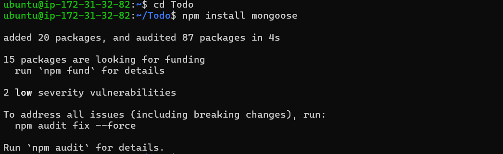
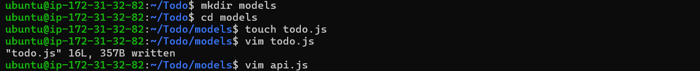

# MERN Web Stack

# STEP 3 - Models
1.  Change directory to Todo folder and install Mongoose using:

```
cd Todo
npm install mongoose
```



2. Create a new todo.js file and inside the models folder using:

```
mkdir models && cd models && touch todo.js
```

```
vim todo.js
```



3. After opening the vim todo.js file editor, paste the code below:

```
const mongoose = require('mongoose');
const Schema = mongoose.Schema;

//create schema or todo
const TodoSchema = new Schema({
action: {
type: String,
required: [true, 'The todo text field is required']
}
})

//create model or todo
const Todo = mongoose.model('todo', TodoSchema);

module.exports = Todo;
```

4. Now, we need to update our routes file by opening our vim api.js in routes directory to make use of the new model. 

```
vim api.js
```

5. Delete the code inside with :%d and paste in the code below:

```
:%d
```

```
const express = require('express');
const router = express.Router();
const Todo = require('../models/todo');

// GET route for fetching all todos
router.get('/todos', (req, res, next) => {
  Todo.find({}, 'action')
    .then(data => res.json(data))
    .catch(next);
});

// POST route for adding a new todo
router.post('/todos', (req, res, next) => {
  if (req.body.action) {
    Todo.create(req.body)
      .then(data => res.json(data))
      .catch(next);
  } else {
    res.json({
      error: "The input field is empty"
    });
  }
});

// DELETE route for removing a todo by ID
router.delete('/todos/:id', (req, res, next) => {
  Todo.findOneAndDelete({ "_id": req.params.id })
    .then(data => res.json(data))
    .catch(next);
});

module.exports = router;
```
