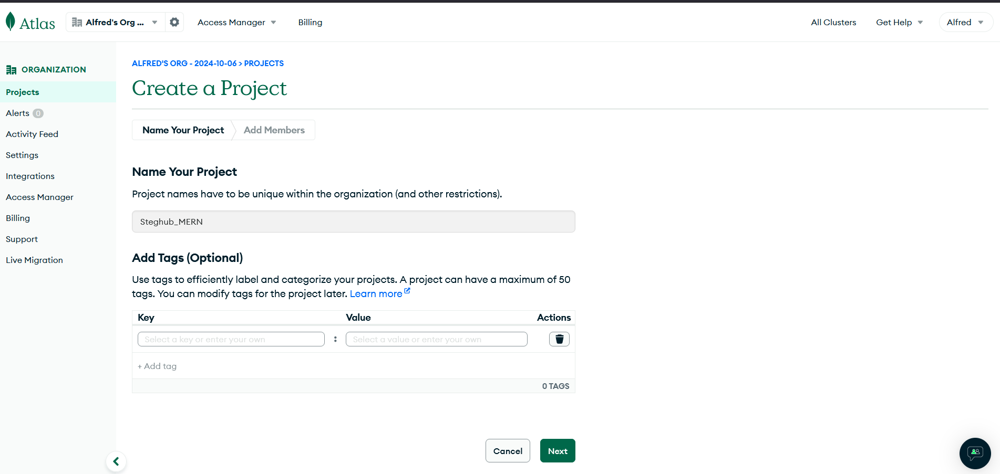

# MERN Web Stack

# STEP 4 - MongoDB Database
1. Signup for MongoDB and create a new project



2. After creating a new proect, create a cluster

3. Select a free version, add a name, Aws cloud and region closest to you.


4. Click on network access and allow from anywehre.


5. Set a Data User credentials of your choice and create Database user.


6. Choose a connection method


7. Enter a username and password. Ensure the “Read and Write to any database under built-in role” option is selected, temporary user is on and set to one week. Click "Add User".


8. Then go back to overview page, click on connect, select drivers and choose Mongoose , copy your conection url, click done.


9. create a file in our Todo directory and name it .env using:

```
touch .env
vi .env
```

10. Paste the connection string to access the database.

```
DB = 'mongodb+srv://<username>:<password>@<network-address>/<dbname>?
retryWrites=true&w=majority'
```

11. Get into the index.js directory already set up using:

```
 vim index.js
```

12. Paste the code inside the vim editor:

```
const express = require('express');
const bodyParser = require('body-parser');
const mongoose = require('mongoose');
const routes = require('./routes/api');
const path = require('path');
  require('dotenv').config();
  const app = express();

const port = process.env.PORT || 5000;

//connect to the database
mongoose.connect(process.env.DB)
.then(() => console.log('Database connected successfully'))
.catch(err => console.log('Error connecting to MongoDB:', err));


//since mongoose promise is depreciated, we overide it with node's promise
mongoose.Promise = global.Promise;

app.use((req, res, next) => {

res.header("Access-Control-Allow-Origin", "\*");
res.header("Access-Control-Allow-Headers", "Origin, X-Requested-With, Content-Type, Accept");
  next();
});

app.use(bodyParser.json());

app.use('/api', routes);

app.use((err, req, res, next) =>  {
console.log(err);
next();
});

app.listen(port, () =>  {
console.log(`Server running on port ${port}`)
});
```

13. Start the server with

```
node index.js
```

The message "Database connected succesfully" will be shown signifying successul connection

