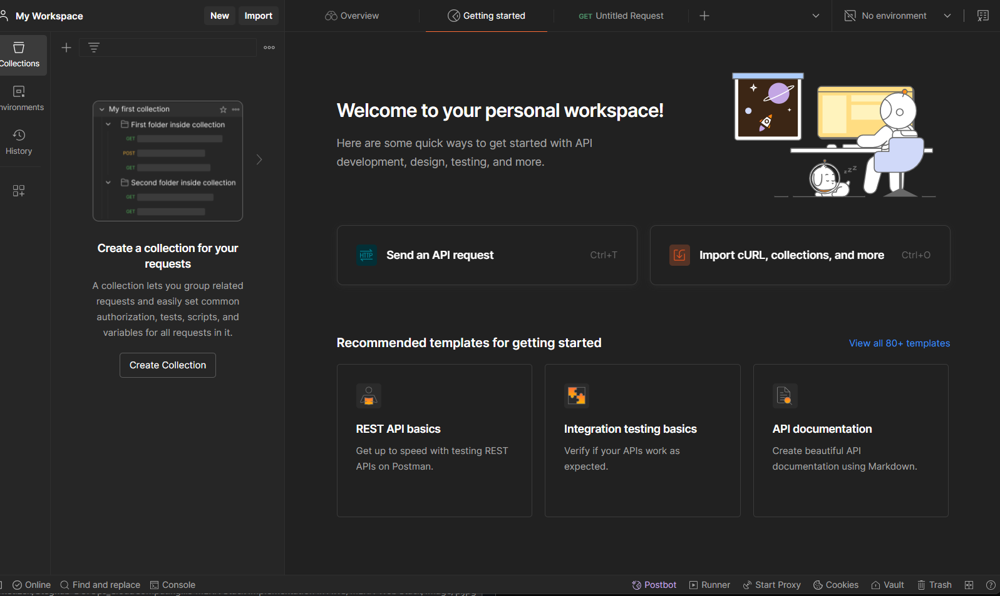
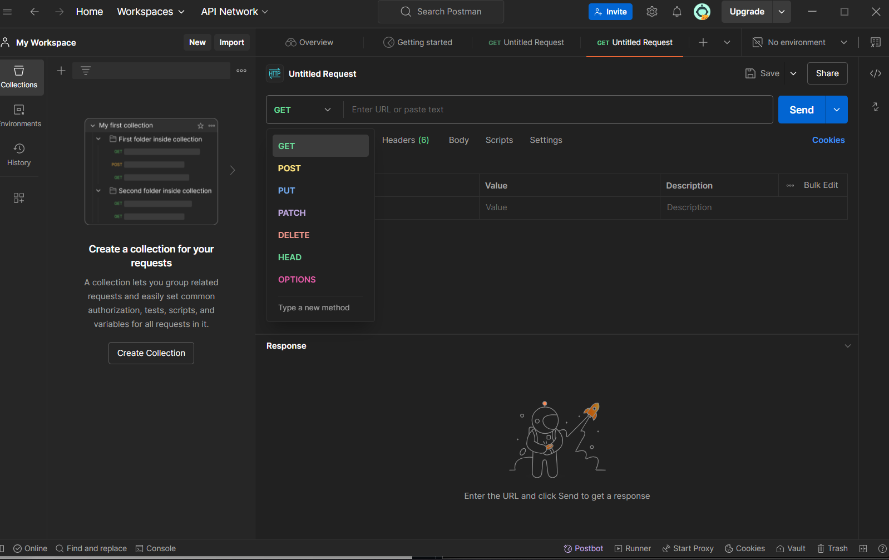
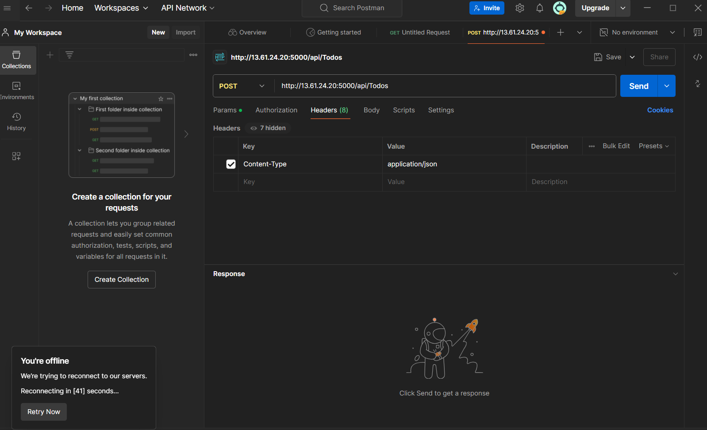
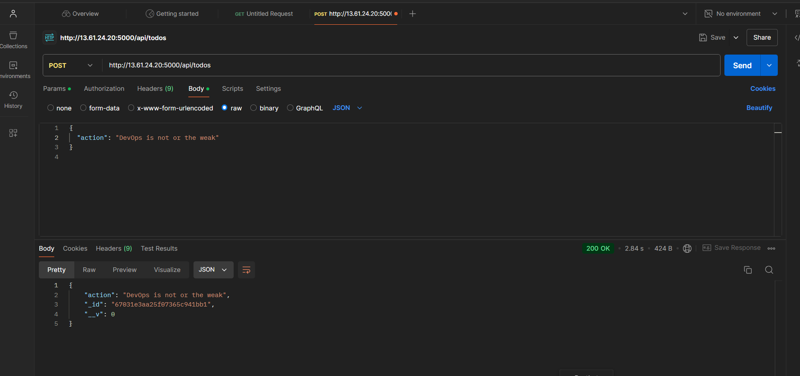

# MERN Web Stack

# STEP 5 - Testing Backend without Frontend using RESTful API

1. To download and install postman: 

```
https://www.postman.com/downloads/
```
Postman App should be looking like this:



2. Open send an API request, and create a POST request to our API(make sure your server is running on your terminal)

```
http://localhost:5000/api/Todos
```


3. In the "Header" menu, Set the key as content-type, Value as application/json.
Press send



Add a json code and press send to post request



4. Create a GET request by Clicking on http, choose GET, add the previous address from the post request, press send


