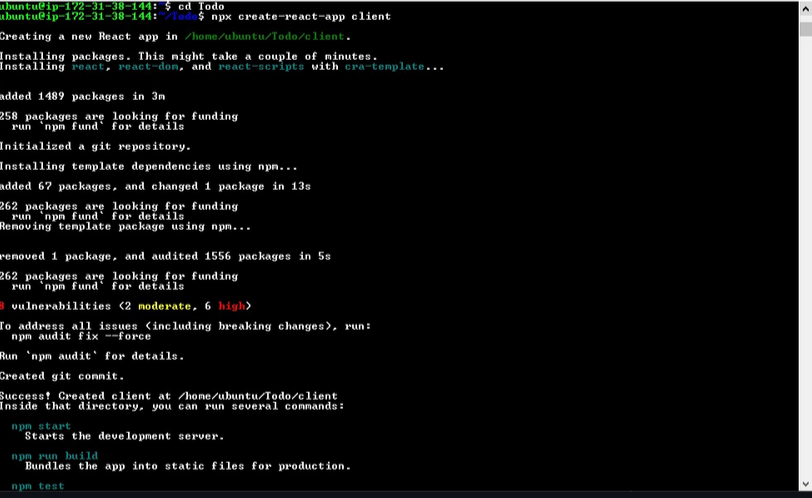
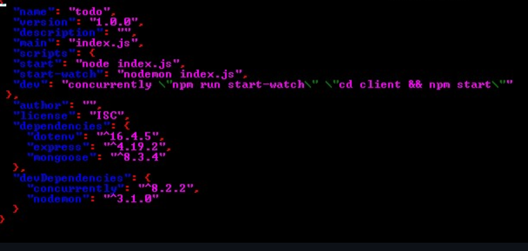
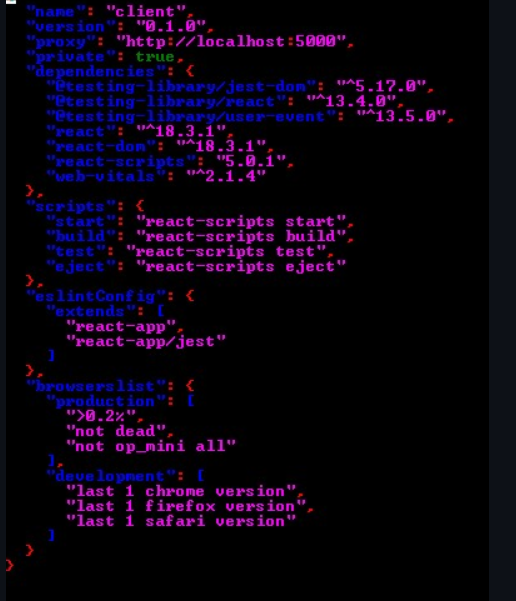
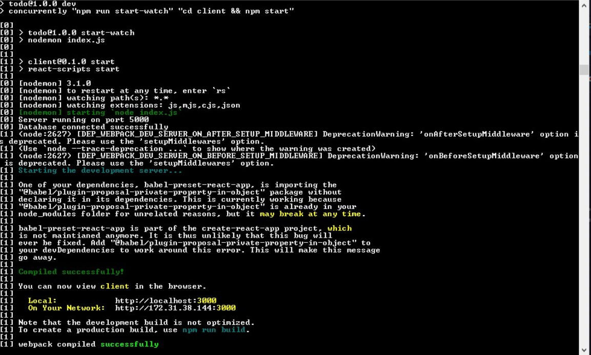

# MERN Web Stack

# STEP 6 - Frontend Creation

1. In the Todo directory, run

```
npx create-react-app client
```



2. Install concurrently

```
npm install concurrently --save-dev
```

3. install nodemon

```
npm install nodemon --save-dev
```

4. Open package.json file using:

```
sudo nano package.json
```



5. Copy and paste the code below:

```
{
  "name": "todo",
  "version": "1.0.0",
  "description": "",
  "main": "index.js",
  "scripts": {
  "start": "node index.js",
  "start-watch": "nodemon index.js",
  "dev": "concurrently \"npm run start-watch\" \"cd client && npm start\""
 },
  "author": "",
  "license": "ISC",
  "dependencies": {
    "dotenv": "^16.4.5",
    "express": "^4.19.2",
    "mongoose": "^8.3.4"
  },
  "devDependencies": {
    "concurrently": "^8.2.2",
    "nodemon": "^3.1.0"
  }
}

```

6. change directory to client

```
cd client
```

7. Open package.json and add:

```
“proxy”: “http://localhost:5000”
```



8. Change directory back to Todo using:

```
cd ../..
```

9. And run

```
npm run dev
```



- The app is now open and running on localhost:3000
