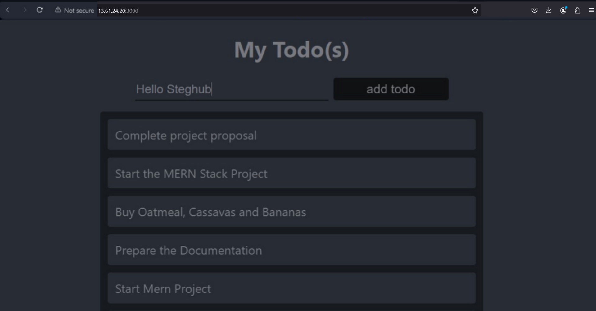

# MERN Web Stack

# STEP 7 - Creating Your React Components

One of the advantages of react is that it makes use of components, which are reusable and also makes code modular.
For the Todo app, there are two stateful components and one stateless component. From Todo directory, run:

```
cd client
```

2. Move to the src director

```
cd src
```

3. Inside your src folder, create another folder called “components”

```
mkdir components
```

4. Move into the components directory

```
cd components
```

image

5. Inside the ‘components’ directory create three files “Input.js”, “ListTodo.js” and “Todo.js”.

```
touch Input.js ListTodo.js Todo.js
```

image

6. Open Input.js file

```
sudo nano Input.js
```

7. Copy and Paste in the following:

```
import React, { Component } from 'react';
import axios from 'axios';

class Input extends Component {
  state = {
    action: ""
  }

  handleChange = (event) => {
    this.setState({ action: event.target.value });
  }

  addTodo = () => {
    const task = { action: this.state.action };

    if (task.action && task.action.length > 0) {
      axios.post('/api/todos', task)
        .then(res => {
          if (res.data) {
            this.props.getTodos();
            this.setState({ action: "" });
          }
        })
        .catch(err => console.log(err));
    } else {
      console.log('Input field required');
    }
  }

  render() {
    let { action } = this.state;
    return (
      <div>
        <input type="text" onChange={this.handleChange} value={action} />
        <button onClick={this.addTodo}>add todo</button>
      </div>
    );
  }
}

export default Input;
```

image

NB: To make use of Axios, which is a Promise based HTTP client for the browser and node.js, you need to cd into your client from your terminal and run npm install axios.

8. Move to the src folder 

```
cd ..
```

9. Move to the client folder 

```
cd ..
```

10. Install Axios 

```
npm install axios
```

image

11. Go to components directory 

```
cd src/components
```

12. After that open the ListTodo.js 

```
vi ListTodo.js
```

13. In the ListTodo.js Copy and paste the following code:

```
import React from 'react';

const ListTodo = ({ todos, deleteTodo }) => {
  return (
    <ul>
      {
        todos && todos.length > 0 ? (
          todos.map(todo => {
            return (
              <li key={todo._id} onClick={() => deleteTodo(todo._id)}>
                {todo.action}
              </li>
            );
          })
        ) : (
          <li>No todo(s) left</li>
        )
      }
    </ul>
  );
}

export default ListTodo;
```

image

14. Then in the Todo.js file, write the following code

```
import React, { Component } from 'react';
import axios from 'axios';

import Input from './Input';
import ListTodo from './ListTodo';

class Todo extends Component {
  state = {
    todos: []
  }

  componentDidMount() {
    this.getTodos();
  }

  getTodos = () => {
    axios.get('/api/todos')
      .then(res => {
        if (res.data) {
          this.setState({
            todos: res.data
          });
        }
      })
      .catch(err => console.log(err));
  }

  deleteTodo = (id) => {
    axios.delete(`/api/todos/${id}`)
      .then(res => {
        if (res.data) {
          this.getTodos();
        }
      })
      .catch(err => console.log(err));
  }

  render() {
    let { todos } = this.state;
    return (
      <div>
        <h1>My Todo(s)</h1>
        <Input getTodos={this.getTodos} />
        <ListTodo todos={todos} deleteTodo={this.deleteTodo} />
      </div>
    );
  }
}

export default Todo;
```

image

- Delete the logo and adjust our App.js to look like this.

15. Move to src folder

```
cd ..
```

16. Make sure to be in the src folder and run:

```
sudo nano App.js
```

17. Copy and paste the following code

```
import React from 'react';
import Todo from './components/Todo';
import './App.css';

const App = () => {
  return (
    <div className="App">
      <Todo />
    </div>
  );
}

export default App;
```

image

18. In the src directory, open the App.css sudo nano App.css

```
Paste the following code into it

.App {
  text-align: center;
  font-size: calc(10px + 2vmin);
  width: 60%;
  margin-left: auto;
  margin-right: auto;
}

input {
  height: 40px;
  width: 50%;
  border: none;
  border-bottom: 2px #101113 solid;
  background: none;
  font-size: 1.5rem;
  color: #787a80;
}

input:focus {
  outline: none;
}

button {
  width: 25%;
  height: 45px;
  border: none;
  margin-left: 10px;
  font-size: 25px;
  background: #101113;
  border-radius: 5px;
  color: #787a80;
  cursor: pointer;
}

button:focus {
  outline: none;
}

ul {
  list-style: none;
  text-align: left;
  padding: 15px;
  background: #171a1f;
  border-radius: 5px;
}

li {
  padding: 15px;
  font-size: 1.5rem;
  margin-bottom: 15px;
  background: #282c34;
  border-radius: 5px;
  overflow-wrap: break-word;
  cursor: pointer;
}

@media only screen and (min-width: 300px) {
  .App {
    width: 80%;
  }

  input {
    width: 100%;
  }

  button {
    width: 100%;
    margin-top: 15px;
    margin-left: 0;
  }
}

@media only screen and (min-width: 640px) {
  .App {
    width: 60%;
  }

  input {
    width: 50%;
  }

  button {
    width: 30%;
    margin-left: 10px;
    margin-top: 0;
  }
}
```

image

19. In the src directory, open the index.css 

```
sudo nano index.css
```

20. Copy and paste the code below:

```
body {
  margin: 0;
  padding: 0;
  font-family: -apple-system, BlinkMacSystemFont, "Segoe UI", "Roboto", "Oxygen", "Ubuntu", "Cantarell", "Fira Sans", "Droid Sans", "Helvetica Neue", sans-serif;
  -webkit-font-smoothing: antialiased;
  -moz-osx-font-smoothing: grayscale;
  box-sizing: border-box;
  background-color: #282c34;
  color: #787a80;
}

code {
  font-family: source-code-pro, Menlo, Monaco, Consolas, "Courier New", monospace;
}
```

image

21. Go to the Todo directory 

```
cd ../..
```

22. Run:

```
npm run dev
```

React build would compile sucessfully and both backend and front end will run concurrently through the ports we earlier opened


