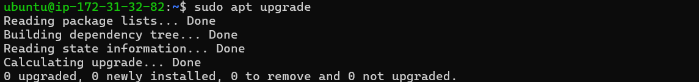
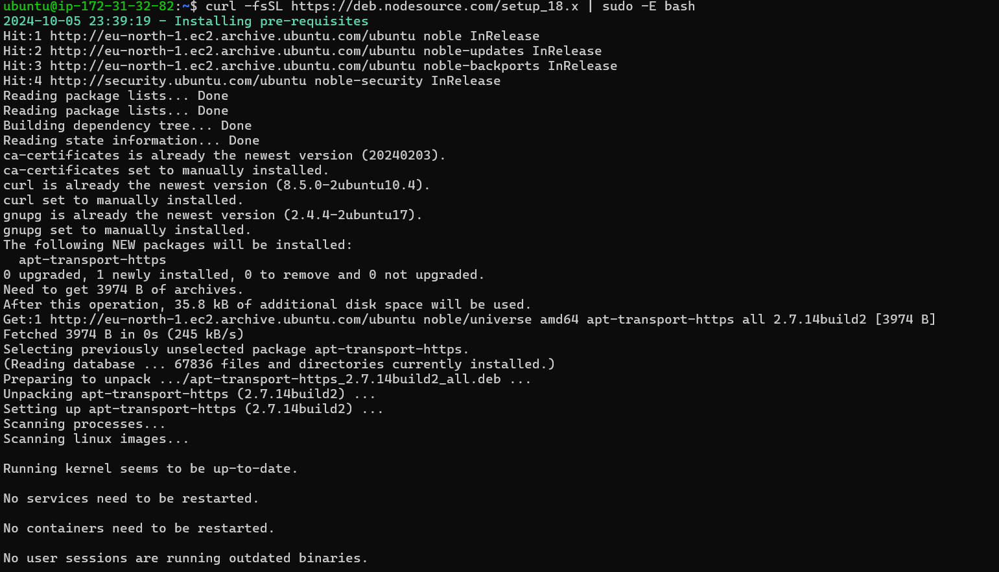
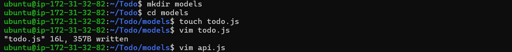
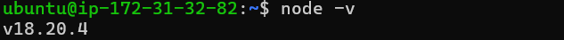
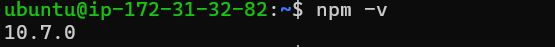
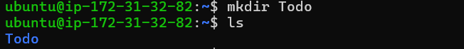
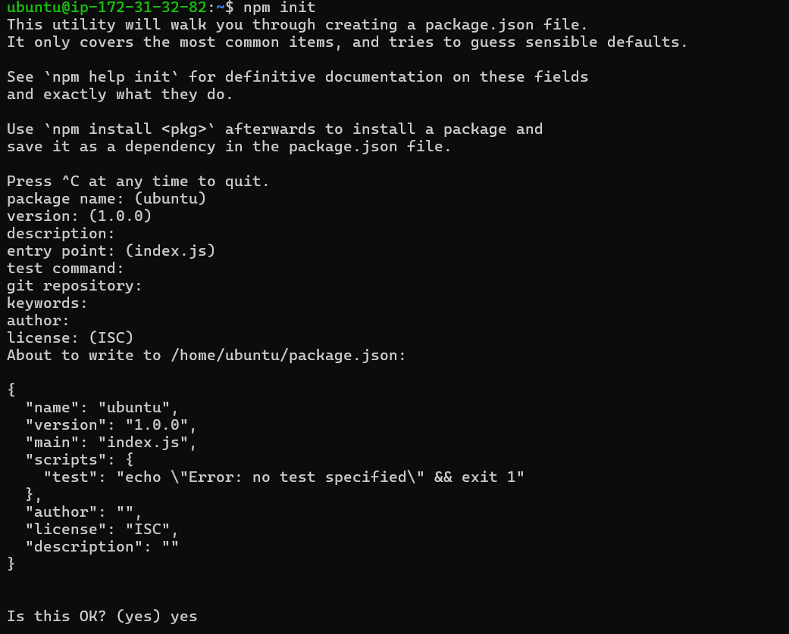

# MERN Web Stack

# STEP 1 - Backend Configuration
1. Update ubuntu using:

```
sudo apt update
```



2. Upgrade ubuntu using:

```
sudo apt upgrade
```


3. To get the location of Node.js sotware from Ubuntu repositories:

```
curl -fsSL https://deb.nodesource.com/setup_18.x | sudo -E bash -
```



4. Install node.js using:

```
sudo apt-get install -y nodejs
```



5. Verfiy the node installation using:

```
node -v
```



6. Veriy the npm installation using:

```
npm -v
```



7. To create a new directory or our To-Do project:

```
mkdir Todo
```

8. Verfiy our Todo directory is created using:

```
ls
```




9. We will now change our directory to Todo using:
```
cd Todo
```

10. To install package.json in our Todo run:

```
npm init
```



