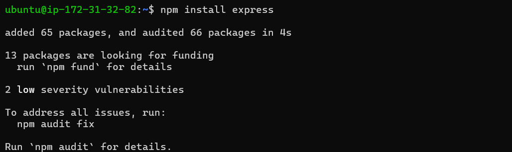
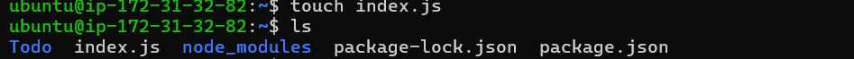
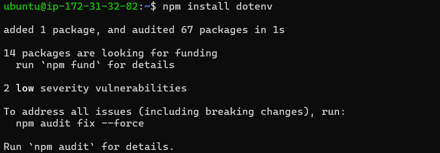
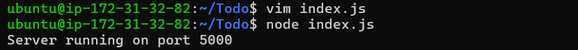
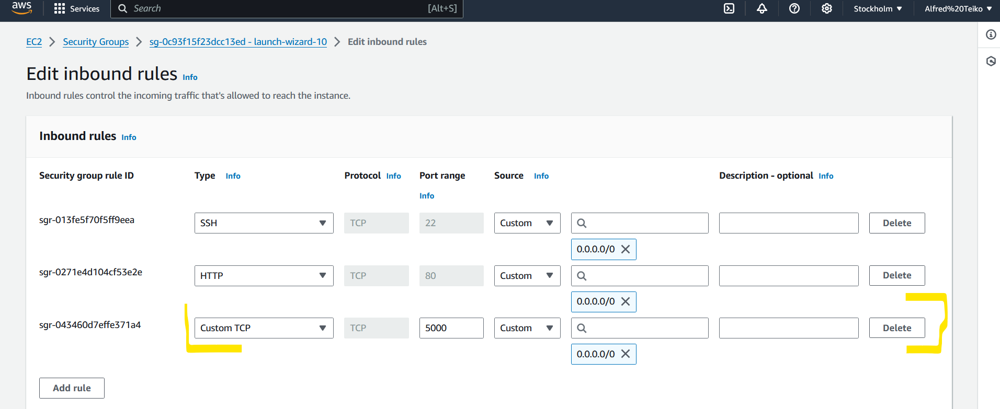
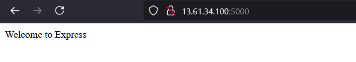
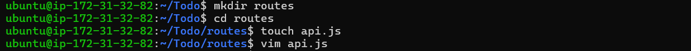

# MERN Web Stack

# STEP 2 - Installing ExpressJS
1. Install express using:

```
npm install express
```



2.  Create a file index.js using:

```
touch index.js
```



3. Install dotenv module:

```
npm install dotenv
```



4. Open the index.js ile using:

```
vim index.js
```

5. Once we are the code editor paste the code below

```
const express = require("express");
require("dotenv").config();

const app = express();

const port = process.env.PORT || 5000;

app.use((req, res, next) => {
  res.header("Access-Control-Allow-Origin", "*");
  res.header(
    "Access-Control-Allow-Headers",
    "Origin, X-Requested-With, Content-Type, Accept"
  );
  next();
});

app.use((req, res, next) => {
  res.send("Welcome to Express");
});

app.listen(port, () => {
  console.log(`Server running on port ${port}`);
});
```

6. To know if our server works, start our server by using:

```
node index.js
```



7. Edit inbound settings of the security group to allow TCP to get connected anywhere:



8. Open it in your web browser using DNS name followed by port 5000:

```
http://<Public-or-PublicDNS>:5000
```



9. Create route using:

```
mkdir
```

10. Change directory using:

```
cd routes
```

11. Create a file api.js using:

```
touch api.s
```

12. Open vim editor using:

```
vim api.js
``` 




13. Now enter the code in the editor:
```
const express = require('express');
const router = express.Router();

router.get('/todos', (req, res, next) => {

});

router.post('/todos', (req, res, next) => {

});

router.delete('/todos/:id', (req, res, next) => {

});

module.exports = router;
```