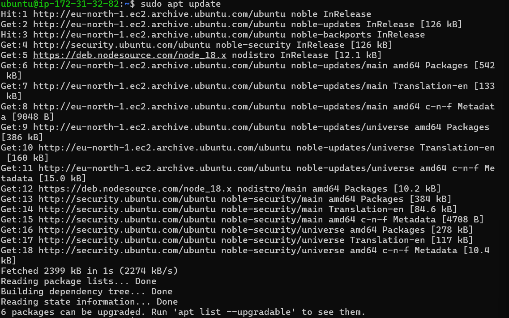
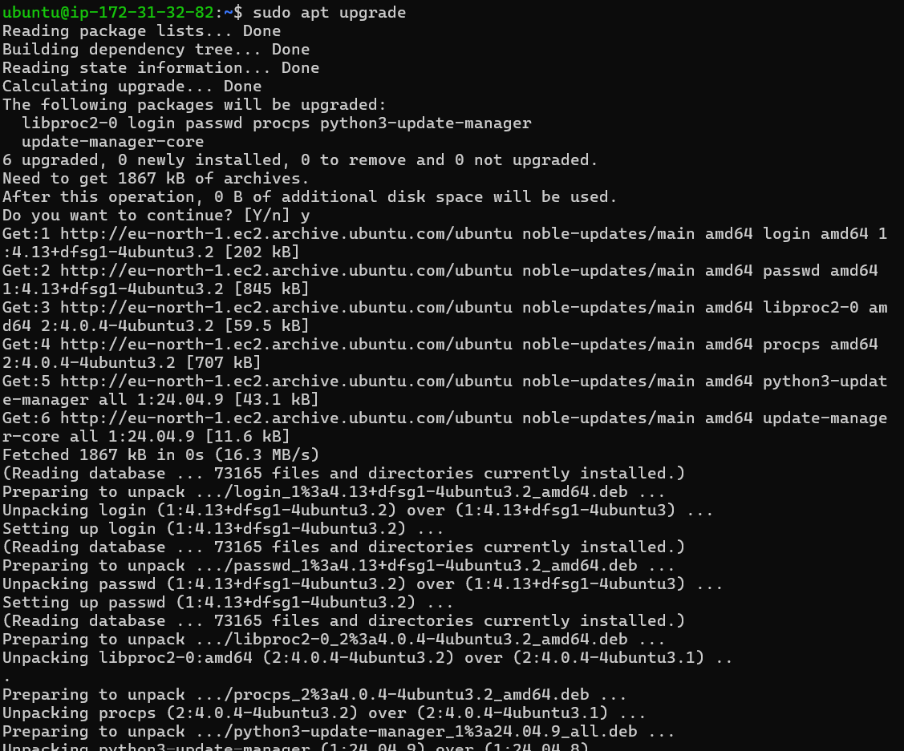
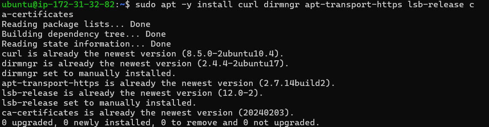
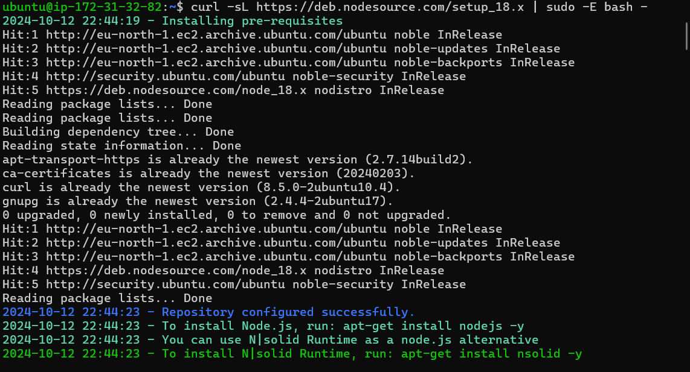
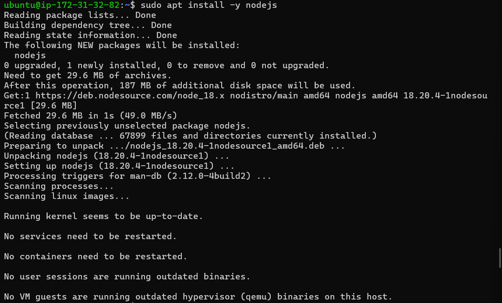

# MEAN Stack Implementation

# Step 1: Install Nodejs

1. Once connected to your EC2 instance, ensure that your Ubuntu operating system is up-to-date. Run the following command to update the package lists and upgrade installed packages:

```
sudo apt update && sudo apt upgrade 
```




2. Install Required Certificates

Before installing Node.js, you need to install some required packages for secure communication. Run the following command:

```
sudo apt -y install curl dirmngr apt-transport-https lsb-release ca-certificates
```



3. Install Node.js

To install Node.js, you need to set up the NodeSource repository. This allows you to install the latest version of Node.js. Run the following command:

```
curl -sL https://deb.nodesource.com/setup_18.x | sudo -E bash -
```




4. After adding the NodeSource repository, install Node.js with:

```
sudo apt install -y nodejs
```




5. Verify Installation

To confirm that Node.js has been successfully installed, you can check the version of Node.js and npm (Node Package Manager) by running:

```
node -v
npm -v
```
