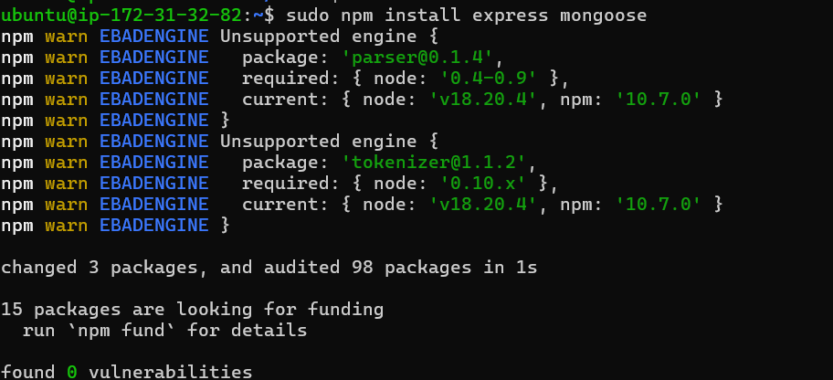
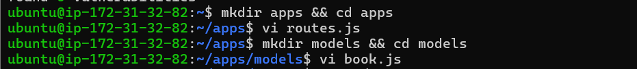

# MEAN Stack Implementation

# Step 3: Installing Express and Setting Up Routes to the Server.

1. Install Express and Mongoose
To handle HTTP requests and connect to MongoDB, you need to install Express (for routing) and Mongoose (for MongoDB interaction). Run the following command to install them:

```
sudo npm install express mongoose
```



2. Create a Directory for Routes
Next, within your `Books` project folder(So change directory to Books ), create a subfolder named `apps` where your routes and models will reside. Change into that directory:

```
mkdir apps && cd apps
```

3. Create `routes.js` File
Inside the `apps` folder, create a file named `routes.js`. This file will handle HTTP requests for your book records:

```
vi routes.js
```

4. Add Routes to `routes.js`
In `routes.js`, paste the following code to define routes for getting, adding, and deleting book records:

```
var Book = require('./models/book');
var path = require('path');

module.exports = function(app) {

  // Get all books
  app.get('/book', async function(req, res) {
    try {
      let result = await Book.find({});
      res.json(result);
    } catch (err) {
      res.status(500).json({ error: err.message });
    }
  });

  // Add a new book
  app.post('/book', async function(req, res) {
    try {
      var book = new Book({
        name: req.body.name,
        isbn: req.body.isbn,
        author: req.body.author,
        pages: req.body.pages
      });
      let result = await book.save();
      res.json({
        message: "Successfully added book",
        book: result
      });
    } catch (err) {
      res.status(500).json({ error: err.message });
    }
  });

  // Delete a book by ISBN
  app.delete('/book/:isbn', async function(req, res) {
    try {
      let result = await Book.findOneAndRemove({ isbn: req.params.isbn });
      res.json({
        message: "Successfully deleted the book",
        book: result
      });
    } catch (err) {
      res.status(500).json({ error: err.message });
    }
  });

  // Serve the index.html file for any other routes
  app.get('*', function(req, res) {
    res.sendFile(path.join(__dirname, '../public', 'index.html'));
  });
};
```

5. Create the Models Directory
Next, inside the `apps` folder, create a subfolder called `models` to define your MongoDB schema:

```
mkdir models && cd models
```

6. Create `book.js` Model File
Within the `models` directory, create a file named `book.js` where you'll define the schema for your book documents:

```
vi book.js
```

7. Add Code to `book.js`
In the `book.js` file, define the Mongoose schema for your books:

```
var mongoose = require('mongoose');

var bookSchema = new mongoose.Schema({
  name: String,
  isbn: { type: String, index: true },
  author: String,
  pages: Number
});

module.exports = mongoose.model('Book', bookSchema);
```



Now, you've successfully set up Express, Mongoose, and the necessary routes and models for your application.

