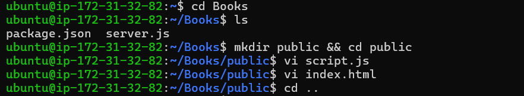
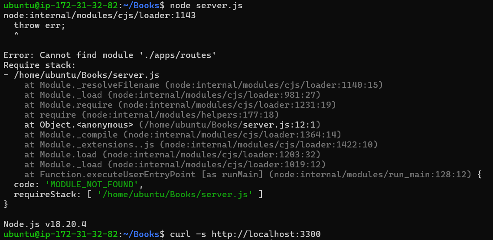
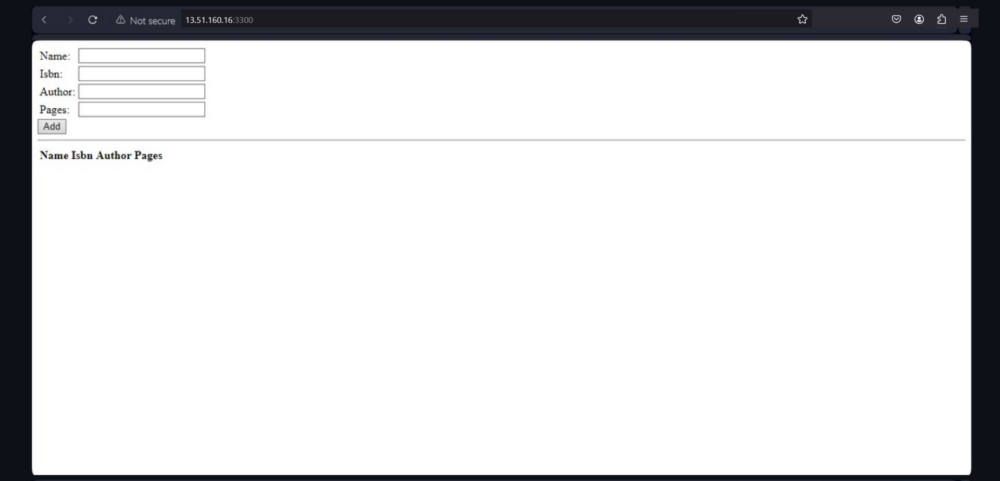

# MEAN Stack Implementation

# Step 4:  Access Routes with AngularJS

To provide a front-end interface for your book management application, we'll use AngularJS to interact with the server-side API and perform CRUD (Create, Read, Update, Delete) operations on books. Follow these steps to set up the AngularJS app.

1. Change Directory to `Books`

Navigate back to the main `Books` directory where your `server.js` file is located:

```
cd ../..
```


2. Create a `public` Directory

Create a new folder named `public` that will contain all the front-end assets like HTML and JavaScript files:

```
mkdir public && cd public
```

3. Create the AngularJS Script

Inside the `public` folder, create a JavaScript file named `script.js` and add the following code. This will be your AngularJS front-end logic to handle requests to the server:

```bash
vi script.js
```

- Now, paste the following AngularJS code in `script.js`:

```
var app = angular.module('myApp', []);
app.controller('myCtrl', function($scope, $http) {
  // Fetch all books
  $http({
    method: 'GET',
    url: '/book'
  }).then(function successCallback(response) {
    $scope.books = response.data;
  }, function errorCallback(response) {
    console.log('Error: ' + response);
  });

  // Delete a book by ISBN
  $scope.del_book = function(book) {
    $http({
      method: 'DELETE',
      url: '/book/:isbn',
      params: {'isbn': book.isbn}
    }).then(function successCallback(response) {
      console.log(response);
    }, function errorCallback(response) {
      console.log('Error: ' + response);
    });
  };

  // Add a new book
  $scope.add_book = function() {
    var body = JSON.stringify({
      name: $scope.Name,
      isbn: $scope.Isbn,
      author: $scope.Author,
      pages: $scope.Pages
    });
    $http({
      method: 'POST',
      url: '/book',
      data: body
    }).then(function successCallback(response) {
      console.log(response);
    }, function errorCallback(response) {
      console.log('Error: ' + response);
    });
  };
});
```

4. Create the `index.html` File

Next, create an `index.html` file that will serve as the front-end interface for your application:

```
vi index.html
```

- Paste the following HTML code into the `index.html` file. This form allows users to add new books and view or delete existing ones:

```html
<!doctype html>
<html ng-app="myApp" ng-controller="myCtrl">
  <head>
    <script src="https://ajax.googleapis.com/ajax/libs/angularjs/1.6.4/angular.min.js"></script>
    <script src="script.js"></script>
  </head>
  <body>
    <div>
      <table>
        <tr>
          <td>Name:</td>
          <td><input type="text" ng-model="Name"></td>
        </tr>
        <tr>
          <td>ISBN:</td>
          <td><input type="text" ng-model="Isbn"></td>
        </tr>
        <tr>
          <td>Author:</td>
          <td><input type="text" ng-model="Author"></td>
        </tr>
        <tr>
          <td>Pages:</td>
          <td><input type="number" ng-model="Pages"></td>
        </tr>
      </table>
      <button ng-click="add_book()">Add Book</button>
    </div>
    <hr>
    <div>
      <table>
        <tr>
          <th>Name</th>
          <th>ISBN</th>
          <th>Author</th>
          <th>Pages</th>
        </tr>
        <tr ng-repeat="book in books">
          <td>{{book.name}}</td>
          <td>{{book.isbn}}</td>
          <td>{{book.author}}</td>
          <td>{{book.pages}}</td>
          <td><input type="button" value="Delete" ng-click="del_book(book)"></td>
        </tr>
      </table>
    </div>
  </body>
</html>
```

5. Start the Server

Once you have the front-end files set up, navigate back to the main `Books` directory:

```
cd ..
```



6. Now, start the server using Node.js:

```
node server.js
```



7. You can launch a separate Putty or SSH console to test what curl command return locally using:

```
curl -s http://localhost:3300
```

8. Open the Application in a Browser

Once the server is running, you can open your browser and go to:

```
http://localhost:3300
```

This will load the AngularJS front-end, allowing you to add, view, and delete books from the MongoDB database.


