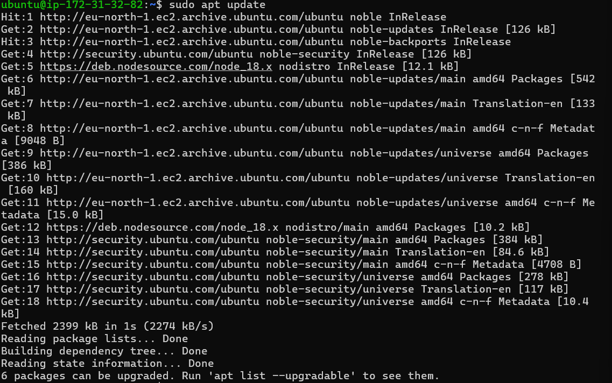

# MEAN Stack Implementation

### Overview
MongoDB is a NoSQL database that stores data in flexible, JSON-like documents. This flexibility allows for varying fields across documents, making it easy to evolve your data structure over time. In this example, we will set up a MongoDB database to store book records, which include the book name, ISBN number, author, and number of pages.

# Step 2: Installing MongoDB

### Step 1: Install Required Packages
Before installing MongoDB, ensure that you have the necessary packages for managing keys and repositories. Run the following command:

```
sudo apt install gnupg curl
```


2. Import the MongoDB Public Key
Next, import the MongoDB GPG key, which allows you to verify the packages you download. Execute the following command:

```
curl -fsSL https://www.mongodb.org/static/pgp/server-7.0.asc | \ sudo gpg -o /usr/share/keyrings/mongodb-server-7.0.gpg \ --dearmor
```


3. Create MongoDB Source List
You need to add the MongoDB repository to your sources list. Create a new list for MongoDB 7.0:

```
echo "deb [ arch=amd64,arm64 signed-by=/usr/share/keyrings/mongodb-server-7.0.gpg ] https://repo.mongodb.org/apt/ubuntu jammy/mongodb-org/7.0 multiverse" | sudo tee /etc/apt/sources.list.d/mongodb-org-7.0.list
```


4. Update the Package List
After adding the MongoDB repository, update your package list to include the new repository:

```
sudo apt update
```



5. Install MongoDB
Now, you can install MongoDB with the following command:

```
sudo apt -y install mongodb-org
```


6. Start the MongoDB Server
To start the MongoDB server, run:

```
sudo systemctl start mongodb
```


7. Verify MongoDB is Running
Check the status of the MongoDB server to ensure it is running correctly:

```
sudo systemctl status mongodb
```


8. Install npm (Node Package Manager)
Now, install npm, which is essential for managing Node.js packages:

```
sudo apt install -y npm
```


9. Install Body-Parser Package
Install the `body-parser` middleware to handle incoming request bodies:

```
sudo npm install body-parser
```


10. Create a Directory for the Application
Create a directory named `Books` to hold your application files:

```
mkdir Books && cd Books
```

11. Initialize npm Project
Inside the `Books` directory, initialize a new npm project by running:

```
npm init
```


12. Create `server.js` File
Create a new file named `server.js`:

```
vi server.js
```

13. Add Server Code
Copy and paste the following code into the `server.js` file to set up a basic Express server:

```
var express = require('express');
var bodyParser = require('body-parser');
var app = express();
app.use(express.static(__dirname + '/public'));
app.use(bodyParser.json());
require('./apps/routes')(app);
app.set('port', 3300);
app.listen(app.get('port'), function() {
    console.log('Server up: http://localhost:' + app.get('port'));
});
```

