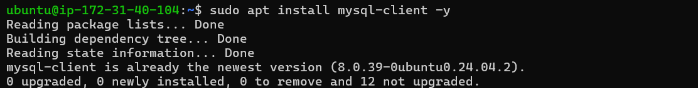

## Server-Side Documentation: Setting Up Client-Server Architecture with MySQL on AWS EC2

### Overview
This document outlines the steps for configuring a client-server architecture with MySQL using two AWS EC2 instances. One instance is configured as the **MySQL Server** and the other as the **MySQL Client**. This setup allows remote connections between the client and the server through a secure configuration.


### Introduction
This guide covers setting up a MySQL client-server architecture using two AWS EC2 instances. The **MySQL Server** instance hosts the MySQL database, while the **MySQL Client** instance connects to it remotely. This setup will demonstrate remote database connections, security configurations, and basic networking troubleshooting.


### Prerequisites
Before beginning, ensure you have:
- Two AWS EC2 instances running Ubuntu (one for the MySQL server and another for the MySQL client).


- Basic knowledge of MySQL database operations, AWS security groups, and Linux commands.
- SSH access to both instances.

### Architecture Overview
The architecture involves two EC2 instances within the same Virtual Private Cloud (VPC) for secure and efficient communication:
1. **MySQL Server Instance** (hosts MySQL)
2. **MySQL Client Instance** (connects remotely to the MySQL server)


### Setting Up MySQL Server (EC2 Instance)
#### Installation
1. SSH into your MySQL server instance:

```
ssh -i "your-key.pem" ubuntu@<mysql-server-public-ip>
```

2. Update package lists and install MySQL server:

```
sudo apt update
sudo apt install mysql-server -y
```


#### Initial Configuration
1. Start and enable the MySQL service:

```
sudo systemctl start mysql
sudo systemctl enable mysql
```


2. Set the root password and configure the MySQL installation:

```
sudo mysql
ALTER USER 'root'@'localhost' IDENTIFIED WITH mysql_native_password BY 'your_unique_password';
FLUSH PRIVILEGES;
EXIT;
```


3. Run the secure installation script to improve security:

```
sudo mysql_secure_installation
```


4. Verify MySQL is running:

```
sudo systemctl status mysql
```

### Configuring Remote Access
To allow remote access to the MySQL server:
1. Open the MySQL configuration file:

```
sudo nano /etc/mysql/mysql.conf.d/mysqld.cnf
```

2. Modify the `bind-address` to allow remote connections:

```ini
bind-address = 0.0.0.0
```


3. Restart MySQL:

```
sudo systemctl restart mysql
```

4. Create a MySQL user for remote access:

```sql
CREATE USER 'remote_user'@'%' IDENTIFIED WITH mysql_native_password BY 'Password.1';
GRANT ALL PRIVILEGES ON *.* TO 'remote_user'@'%';
FLUSH PRIVILEGES;
```


### Setting Up MySQL Client (EC2 Instance)
1. SSH into your MySQL client instance:

```
ssh -i "your-key.pem" ubuntu@<mysql-client-public-ip>
```

2. Install the MySQL client:

```
sudo apt update
sudo apt install mysql-client -y
```




3. Verify the installation:

```
mysql --version
```

### Configuring AWS Security Groups
To allow traffic between the client and server:
1. Modify the security group of the **MySQL Server** instance to allow MySQL traffic:
- **Inbound Rule**:
 - Type: MySQL/Aurora
    - Protocol: TCP
    - Port: 3306
    - Source: `<mysql-client-private-IP>`

2. Ensure **MySQL Client** has the necessary SSH access.

### Establishing a Connection
To connect the MySQL client to the MySQL server:
1. From the MySQL client instance, run:

```
mysql -h <mysql-server-private-ip> -u remote_user -p
```


2. Enter the password when prompted.

## Showing Database
!. Type "SHOW DATABASEs;" to display mysql database.

### Final Steps and Reflections
Once connected, you can start performing database operations on the MySQL server, like creating databases and tables:

```sql
CREATE DATABASE Alfred_Teiko;
```


Ensure your security configuration is optimized for production to prevent unauthorized access.

