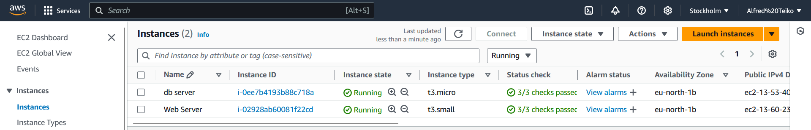
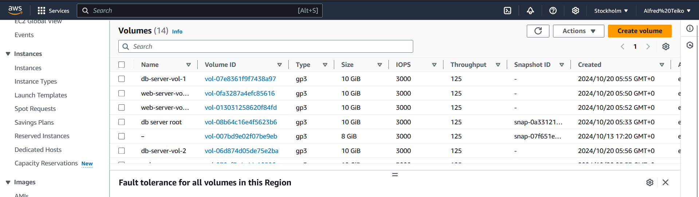

# Introduction to Web Solution with WordPress

This project outlines the process of deploying a WordPress application on an AWS EC2 instance using Red Hat Enterprise Linux (RHEL) 9.4. The architecture includes two EC2 instances, each configured with 3 EBS volumes of 10GB capacity. One instance will serve as the **web server** running the WordPress application, while the other will act as the **database server**, hosting MySQL. 

- **Web Server**: Runs the WordPress application.
- **Database Server**: Hosts MySQL.

The **web server** is set up with a t2.small instance type to ensure sufficient resources for handling WordPress, while the **database server** runs on a t2.micro instance.

### AWS EC2 Instances Setup

#### Prerequisites
Before beginning the setup, ensure the following:

- Two AWS EC2 instances running Red Hat Enterprise Linux 9.4: one for WordPress and one for MySQL.
- Basic understanding of AWS services, particularly EC2 and Logical Volume Manager (LVM).
- Secure Shell (SSH) access to both instances.
- The web server instance should have a minimum size of **t2.small** to prevent issues during package installation.

#### Architecture Overview
1. **Web Server Instance**:
 - Instance Type: t2.small
 - 3 EBS Volumes of 10GB each: `/dev/xvdb`, `/dev/xvdc`, `/dev/xvdd`

2. **Database Server Instance**:
 - Instance Type: t2.micro
 - 3 EBS Volumes of 10GB each: `/dev/xvdb`, `/dev/xvdc`, `/dev/xvdd`

Both servers utilize Logical Volume Manager (LVM) to manage the attached EBS volumes efficiently. LVM allows for easier scaling and dynamic management of storage volumes, ensuring no downtime during modifications. The EBS volumes must be created in the same availability zone as the instance they are attached to.

### Step-by-Step Procedure for AWS EC2 Instance Setup

#### 1. Launch EC2 Instances:
- Create two EC2 instances running Red Hat Enterprise Linux 9.4.
- The web server instance must be at least t2.small, and ensure to note the availability zone for consistency in EBS attachment.

#### 2. Attach EBS Volumes:
- Attach three EBS volumes to each instance to handle application data and logs.
- Label the EBS volumes for clear identification:
 - **Web Server**: `web-server-root`, `web-server-vol-1`, `web-server-vol-2`, `web-server-vol-3`
 - **Database Server**: `db-server-root`, `db-server-vol-1`, `db-server-vol-2`, `db-server-vol-3`

