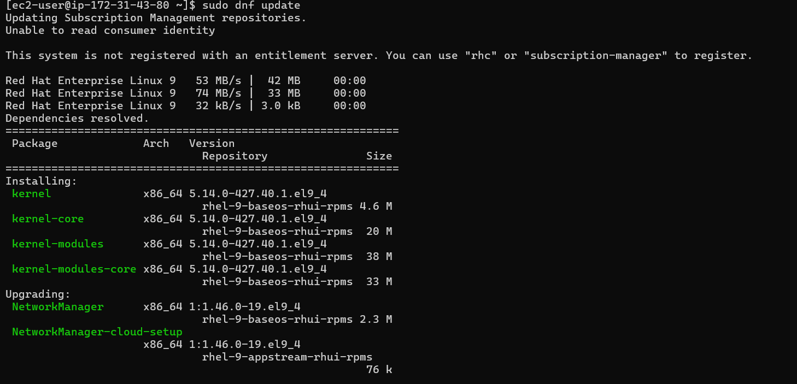

### Configuring EBS and Logical Volume Manager (LVM) on the Web Server

After launching and attaching the volumes, the next step is configuring them for use with LVM.

#### 1. Connect via SSH and Verify EBS Visibility:
- Access the web server using SSH and check the visibility of the attached EBS volumes:

```bash
lsblk
```

- The new volumes will appear as `/dev/nvme1n1`, `/dev/nvme2n1`, and `/dev/nvme3n1`.


#### 2. Install LVM Tools:
- Install necessary LVM and utility tools, such as `nano` and `wget`:

```bash
sudo dnf update
sudo dnf install lvm2 nano wget
```




#### 3. Create Partitions on EBS Volumes:
- Using `gdisk`, create partitions for each EBS volume:

```bash
sudo gdisk /dev/xvdb
```

- Repeat for `/dev/nvme2n1`, and `/dev/nvme3n1`, using the `n`, `p`, and `w` commands to create and save the partition table.


Confirm the partitions using lsblk

```
lsblk
```


#### 4. Set Up LVM:
- Convert EBS partitions into physical volumes (PVs):

 ```bash
sudo pvcreate /dev/xvdb1 /dev/xvdc1 /dev/xvdd1
```

- Create a volume group (VG) by aggregating the physical volumes:

```bash
sudo vgcreate webdata-vg /dev/xvdb1 /dev/xvdc1 /dev/xvdd1
```

- Create logical volumes (LVs) for the WordPress application and log data:

```bash
sudo lvcreate -n app-lv -L 14G webdata-vg
sudo lvcreate -n log-lv -L 14G webdata-vg
```


#### 5. File System Creation and Mounting:

- Create the necessary ext4 file systems on the logical volumes:

```bash
sudo mkfs -t ext4 /dev/webdata-vg/app-lv
sudo mkfs -t ext4 /dev/webdata-vg/log-lv
```


- Mount the logical volumes to their respective directories:

```bash
sudo mkdir -p /var/www/html /home/recovery/logs
sudo mount /dev/webdata-vg/app-lv /var/www/html
sudo mount /dev/webdata-vg/log-lv /var/log
```

#### 6. Backup and Restore Logs:
- Before mounting the logs volume, back up the `/var/log` directory:

```bash
sudo rsync -av /var/log/ /home/recovery/logs/
```

- After mounting, restore the logs to the mounted volume:

```bash
sudo rsync -av /home/recovery/logs/ /var/log/
```

#### 7. Make Mounts Persistent:
- To ensure the volumes automatically mount on reboot, update the `/etc/fstab` file:
- Obtain UUIDs for the logical volumes using:

```bash
sudo blkid
```


- Update the `/etc/fstab` file with the UUIDs:

```bash
UUID=<app-lv-UUID> /var/www/html ext4 defaults 0 0
UUID=<log-lv-UUID> /var/log ext4 defaults 0 0
```

- Test the configuration:

```bash
sudo systemctl daemon-reload
sudo mount -a
```


