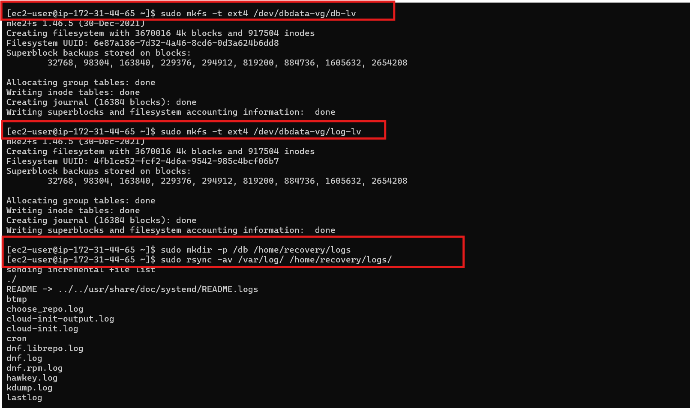
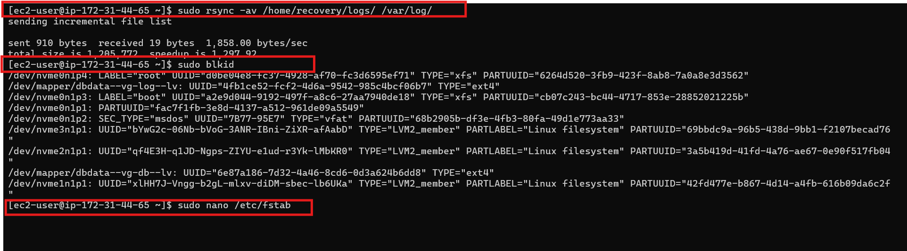

### Configuring EBS and LVM on the Database Server

The steps for configuring EBS and LVM on the database server are similar to those used for the web server:

1. SSH into the database server and verify volume visibility using `lsblk`.


2. Partition the volumes, create physical volumes, and group them under a volume group (`dbdata-vg`).
3. Create logical volumes for database data and logs, configure the file systems, and mount them.
4. Ensure that mounts are persistent using `/etc/fstab`.

**Step 1: Install LVM Tools**
LVM (Logical Volume Manager) tools such as `lvm2` are required to manage physical and logical volumes in Linux. Additionally, `nano` is used as a text editor, and `wget` is for downloading files.

```
sudo dnf update
```


```
sudo dnf install lvm2 nano wget
```


- **Why?**: LVM provides flexibility in managing storage by allowing dynamic resizing of partitions, making it ideal for environments like AWS where storage needs can change. Installing these tools is essential for partitioning, volume creation, and resizing.

**Step 2: Create Partitions on EBS Volumes**
Using `gdisk`, partitions are created on EBS volumes before converting them into physical volumes.

```bash
sudo gdisk /dev/nvme1n1p1
```


Follow these commands:
- `n`: Create a new partition.
- `p`: Print the partition table.
- `w`: Write changes to disk.

Repeat the process for other volumes:

```bash
sudo gdisk /dev/nvme2n1p1
sudo gdisk /dev/nvme3n1p1
```

Use `lsblk` to confirm the partitions:

```bash
lsblk
```


- **Why?**: Partitioning the EBS volumes allows you to logically separate data on the storage disks. Even if using a full volume, partitioning provides an extra level of control and organization when managing multiple disks.

**Step 3: Create Physical Volumes**
Convert the partitions into physical volumes, which are the basic storage units for LVM.

```bash
sudo pvcreate /dev/nvme1n1p1 /dev/nvme2n1p1 /dev/nvme3n1p1
```

- **Why?**: Physical volumes (PVs) act as building blocks for the volume group. By aggregating multiple PVs, LVM allows for easier scalability and redundancy.

**Step 4: Create Volume Group**
A volume group (VG) combines multiple physical volumes into a single pool of storage.

```bash
sudo vgcreate dbdata-vg /dev/xvdb1 /dev/xvdc1 /dev/xvdd1
```

- **Why?**: Creating a VG provides a single pool of storage from which logical volumes can be allocated. This abstraction layer enables dynamic storage management and more efficient use of disk space.

**Step 5: Create Logical Volumes**
Logical volumes (LVs) are created within the volume group for application data and log storage.

```bash
sudo lvcreate -n db-lv -L 14G dbdata-vg
sudo lvcreate -n log-lv -L 14G dbdata-vg
```


- **Why?**: Logical volumes allow for flexible partitioning of the volume group's storage. In this case, separating the data and logs makes it easier to manage disk space usage and helps with backup and recovery operations.

Use `lsblk` to verify:
```bash
lsblk
```

**Step 6: Create Filesystem and Mount Logical Volumes**
Create an ext4 filesystem on the logical volumes.

```bash
sudo mkfs -t ext4 /dev/dbdata-vg/db-lv
sudo mkfs -t ext4 /dev/dbdata-vg/log-lv
```



Create the necessary directories for mounting:

```bash
sudo mkdir -p /db /home/recovery/logs
```

Backup the existing `/var/log` data:

```bash
sudo rsync -av /var/log/ /home/recovery/logs/
```

Mount the logical volumes:

```bash
sudo mount /dev/dbdata-vg/db-lv /db
sudo mount /dev/dbdata-vg/log-lv /var/log
```

Restore the `/var/log` data:

```bash
sudo rsync -av /home/recovery/logs/ /var/log/
```



- **Why?**: Creating separate filesystems on logical volumes enhances performance and provides isolation between different types of data (such as logs and application data). Mounting them ensures data is stored and managed on the correct disk volumes.

**Step 7: Persistent Mounts**
To ensure the logical volumes are automatically mounted at boot, update the `/etc/fstab` file with UUIDs.

Get the UUIDs of the logical volumes:

```bash
sudo blkid
```

Edit `/etc/fstab` to add the volumes:

```bash
sudo nano /etc/fstab
```

Add the following lines:

```
UUID=<db-lv-uuid> /db ext4 defaults 0 0
UUID=<log-lv-uuid> /var/log ext4 defaults 0 0
```

Reload the system daemon and test the mounts:

```bash
sudo systemctl daemon-reload
sudo mount -a
```
