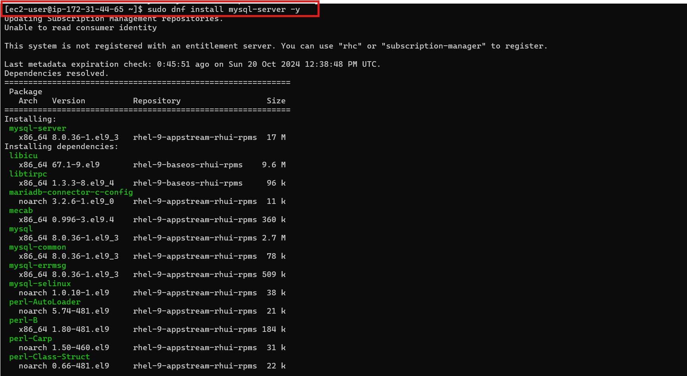
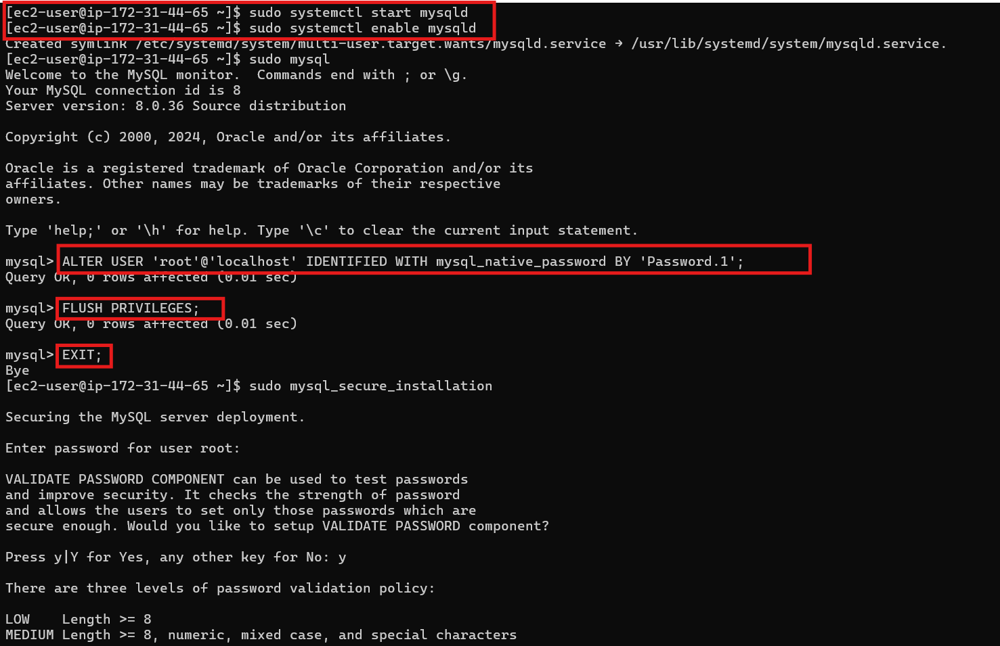
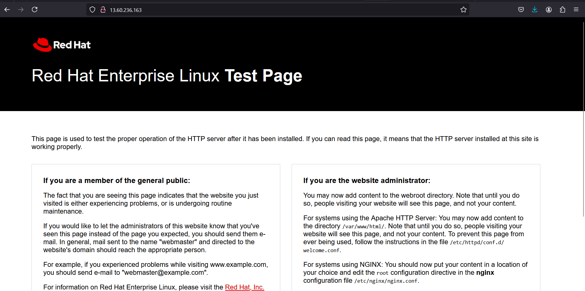
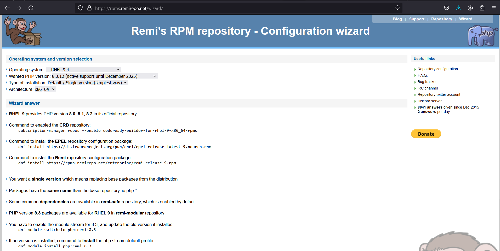
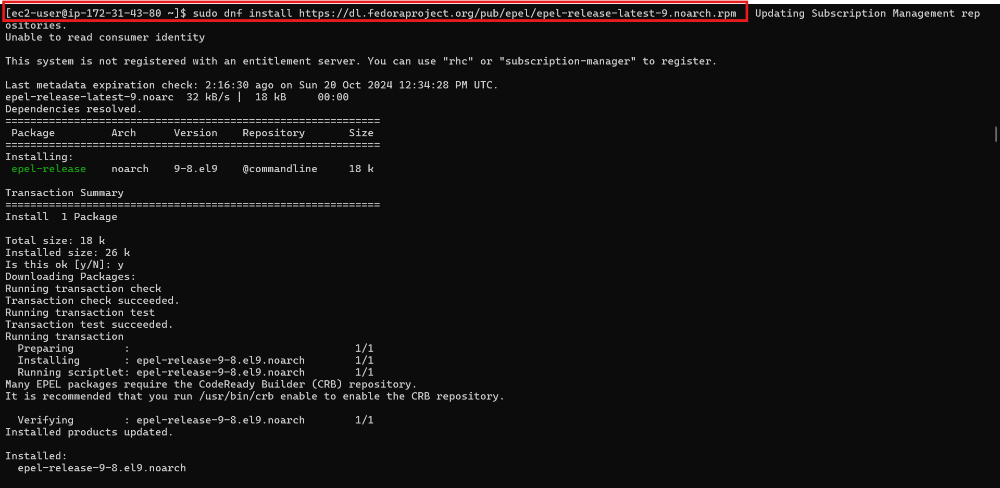
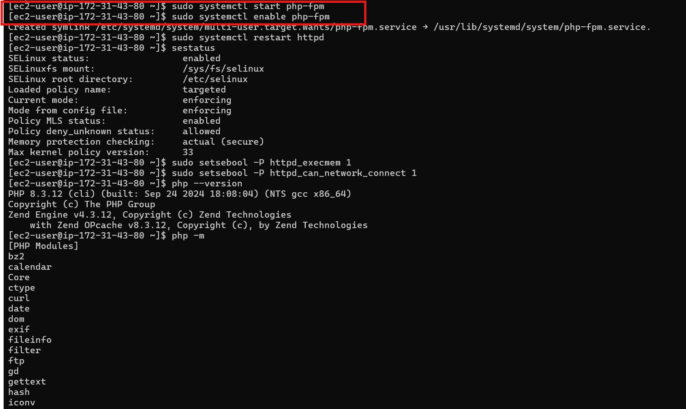

### AWS Security Group Configuration

To ensure secure communication between the WordPress and MySQL instances, security groups were configured with specific rules to control access.

#### MySQL Security Group:
- **Port 3306**: Opened to allow traffic from the private IP of the WordPress web server for database communication.
- **Port 22 (SSH)**: Opened to enable secure administrative access to the MySQL instance.

#### WordPress Security Group (default):
- **Port 80 (HTTP)**: Opened to allow public web traffic.
- **Port 22 (SSH)**: Opened for secure administrative access.

### Installing and Configuring MySQL Database Server

While connected to the **db-server** instance, follow these steps to install and set up MySQL:

1. **Update the system and install MySQL server:**

```bash
sudo dnf update
sudo dnf install mysql-server -y
```



2. **Start and enable the MySQL service:**

```bash
sudo systemctl start mysqld
sudo systemctl enable mysqld
```

3. **Configure the MySQL root password:**

Enter the MySQL shell and set the root password.

```bash
sudo mysql
ALTER USER 'root'@'localhost' IDENTIFIED WITH mysql_native_password BY 'Password.1';
FLUSH PRIVILEGES;
EXIT;
```



4. **Run the secure installation script:**

```bash
sudo mysql_secure_installation
```

**Note**: Initially, I ran the `mysql_secure_installation` script without setting the root password, which locked me out of the root account. This was a reminder of the importance of following the correct configuration sequence.

5. **Verify that MySQL is running:**

```bash
sudo systemctl status mysqld
```

6. **Create the WordPress database and user:**

```bash
sudo mysql -u root -p
CREATE DATABASE wordpress;
CREATE USER 'myuser'@'172.31.3.201' IDENTIFIED WITH mysql_native_password BY 'Password.1';
GRANT ALL PRIVILEGES ON wordpress.* TO 'myuser'@'172.31.3.201';
FLUSH PRIVILEGES;
EXIT;
```

### Testing Remote MySQL Connection

To test remote access to the database from the **web-server** instance:

1. **Install the MySQL client:**

```bash
sudo dnf install mysql
```

2. **Connect to the MySQL server:**

```bash
sudo mysql -h 172.31.3.113 -u myuser -p
```

If successful, you will be able to access the MySQL shell, confirming the setup was successful.

### Installing Apache, PHP 8.3, and PHP Extensions on the Web Server Instance

#### Step 1: Verify the RHEL Version

Ensure that your system is running **RHEL 9.4**:

```bash
cat /etc/redhat-release
```

You should see output like:

```
Red Hat Enterprise Linux release 9.4 (Plow)
```

#### Step 2: Install Apache (httpd)

WordPress requires a web server to handle HTTP requests. Apache is the most commonly used web server for WordPress.

1. **Install Apache:**

```bash
sudo dnf install httpd
```

2. **Start and enable Apache:**

```bash
sudo systemctl start httpd
sudo systemctl enable httpd
```

3. **Verify that Apache is running:**

```bash
sudo systemctl status httpd
```

4. **Access the Apache default page**: Visit `http://your-server-ip` in a web browser. If everything is set up correctly, you will see the default Red Hat page.



#### Step 3: Enable Necessary Repositories

To install PHP 8.3, you must enable additional repositories.



1. **Install the EPEL Repository:**

```bash
sudo dnf install https://dl.fedoraproject.org/pub/epel/epel-release-latest-9.noarch.rpm
```



2. **Install the Remi Repository for PHP 8.3:**

```bash
sudo dnf install https://rpms.remirepo.net/enterprise/remi-release-9.rpm
```

#### Step 4: Install PHP 8.3 and Required Extensions

1. **Switch to the PHP 8.3 module stream:**

```bash
sudo dnf module switch-to php:remi-8.3
```

2. **Install PHP 8.3 and necessary extensions:**

```bash
sudo dnf install php php-opcache php-gd php-curl php-mysqlnd php-xml php-json php-mbstring php-intl php-soap php-zip
```

**Explanation of Key Extensions**:
- `php-opcache`: Improves performance by caching compiled PHP code.
- `php-gd`: Enables image manipulation (used for WordPress image handling).
- `php-curl`: Allows external HTTP requests (important for WordPress API calls).
- `php-mysqlnd`: Enables native MySQL database interaction.
- `php-mbstring`: Supports multiple languages in WordPress.

3. **Start and enable PHP-FPM**:

```bash
sudo systemctl start php-fpm
sudo systemctl enable php-fpm
```



4. **Restart Apache to apply changes:**

```bash
sudo systemctl restart httpd
```

#### Step 5: Configure SELinux (Security-Enhanced Linux)

SELinux is an important security feature that restricts access control policies. On RHEL, it's often enabled by default.

1. **Check SELinux status:**

```bash
sestatus
```

Expected output:

 ```
SELinux status:                 enabled
Current mode:                   enforcing
```

2. **Allow Apache to execute memory operations (needed by PHP’s OpCache):**

```bash
sudo setsebool -P httpd_execmem 1
```

3. **Allow Apache to make network connections (for API calls or plugin updates):**

```bash
sudo setsebool -P httpd_can_network_connect 1
```

#### Step 6: Verify PHP Installation

1. **Check the PHP version:**

```bash
php --version
```

You should see:

```
PHP 8.3.12 (cli) (built: Sep 26 2024 02:19:56)
```

2. **List the installed PHP modules:**

```bash
php -m
```

Ensure that all required modules (like `curl`, `gd`, `mbstring`, etc.) are listed to support the WordPress installation.