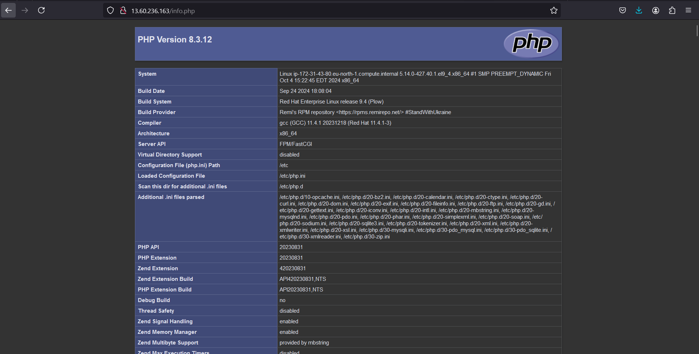
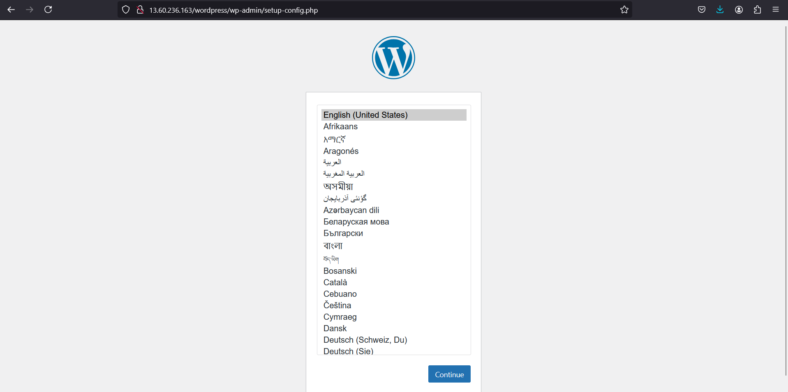
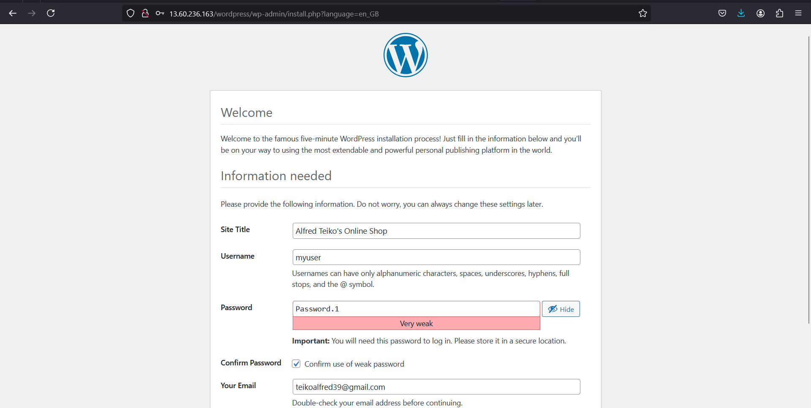

### Step 7: Test PHP Functionality

To verify that PHP is working correctly on your Apache server, we create a simple PHP script called `info.php`, which will display details about your PHP configuration when accessed through a browser.

1. **Create a PHP Info Page**: This is essential for testing if the Apache server can correctly interpret and serve PHP files.
   
- Open the terminal and create a new PHP file in the default web directory of Apache (`/var/www/html/`):

```bash
sudo nano /var/www/html/info.php
```

- Add the following PHP code into the file:

```php
<?php
phpinfo();
?>
```

- **What does this do?**: The `phpinfo()` function is a built-in PHP function that outputs detailed information about the PHP environment, such as the PHP version, enabled modules, configuration settings, and paths.

2. **Access the PHP Info Page**: Open your web browser and navigate to the following URL (replace `your-server-ip` with your server's IP address or domain name):

```
http://your-server-ip/info.php
```



- **Why?**: This step ensures that PHP is properly installed and integrated with the Apache web server. If PHP is working, you will see a page displaying various configuration details about your PHP installation.

3. **Delete the `info.php` File After Testing**: 

```bash
sudo rm /var/www/html/info.php
```

- **Why remove it?**: Leaving this file accessible poses a security risk, as it reveals sensitive information about your PHP configuration that could be exploited by attackers.

---

### WordPress Installation

**1. Install the `wget` Package**: 

First, install `wget`, a command-line utility for downloading files from the internet.

```bash
sudo dnf install wget
```

- **Why?**: `wget` is used to download the latest version of WordPress from the official website.

**2. Download the Latest Version of WordPress**: 

Use `wget` to download the WordPress archive:

```bash
sudo wget https://wordpress.org/latest.tar.gz
```

- **Why?**: This command downloads the most up-to-date version of WordPress, packaged as a compressed `.tar.gz` file.

**3. Extract the WordPress Archive**: 

Extract the contents of the downloaded file using the `tar` command:

```bash
sudo tar -xzvf latest.tar.gz
sudo rm latest.tar.gz
```

- **Breakdown of the `tar -xzvf` command**:
 - `x`: Extracts files from the archive.
 - `z`: Decompresses the file, as it is compressed with gzip (indicated by the `.gz` extension).
 - `v`: Shows verbose output, displaying the progress and listing extracted files.
 - `f`: Specifies the file to be extracted (`latest.tar.gz`).

- **Why?**: Extracting the files makes the WordPress installation files available on your server.

**4. Move WordPress to the Web Root**: 

Move the extracted WordPress directory to Apache's web root:

```bash
sudo mv wordpress/ /var/www/html/
```

- **Why?**: The web root (`/var/www/html/`) is where Apache serves files to the browser. Moving WordPress here makes it accessible via a web browser.

**5. Set Correct Permissions for WordPress**:

WordPress needs the correct permissions to allow Apache (the web server) to read and write files, especially for tasks like uploading media, installing plugins, and updating the site.

- Change the ownership of the WordPress directory to the Apache user and group:

```bash
sudo chown -R apache:apache /var/www/html/wordpress
```

- Set directory permissions:

```bash
sudo chmod -R 755 /var/www/html/wordpress
```

- Set SELinux context (for systems with SELinux enabled):

```bash
sudo chcon -t httpd_sys_rw_content_t /var/www/html/wordpress -R
```

- **Why?**: 
 - `chown` ensures Apache has full control over the WordPress directory and its contents, which is crucial for executing tasks like file uploads and updates.
 - `chmod 755` sets the directory to be readable and executable by everyone but only writable by the owner (Apache), ensuring security.
 - The `chcon` command modifies the SELinux context to allow Apache to write to these directories. Without this, Apache may be blocked by SELinux, causing WordPress features like plugin installations or media uploads to fail.

**6. Restart Apache**:

Restart the Apache web server to apply the new configuration and permission changes:

```bash
sudo systemctl restart httpd
```

- **Why?**: Restarting Apache ensures that all the changes made to the web server (such as new files and permissions) are correctly applied.

---

### Accessing WordPress Installation Wizard

Once the above steps are complete, open a browser and access your WordPress installation by navigating to:

```
http://your-server-ip/wordpress
```






- **Why?**: This URL will open the WordPress installation wizard, where you can complete the setup process by configuring the database and setting up your site.

---

### Final Steps and Reflections

After completing the WordPress installation, the infrastructure consists of:

- **WordPress on an EC2 Instance**: Hosting the WordPress application on one EC2 instance.
- **MySQL on a Separate EC2 Instance**: A dedicated database instance for better performance and security.
- **EBS Volumes Managed by LVM**: The use of Logical Volume Manager (LVM) for EBS storage allows flexibility in managing disk space without the need to stop the instance or detach/attach volumes.

---

### Reflections on LVM and Instance Types

1. **LVM Benefits**: LVM (Logical Volume Manager) provided significant advantages by allowing us to dynamically manage storage. This is especially useful in cloud environments, like AWS, where storage needs may increase. Instead of reformatting or unmounting drives, LVM allows resizing volumes without disrupting the service.
  
2. **Instance Types**: Using `t2.small` instances ensured there were enough CPU and memory resources to prevent bottlenecks during the setup and installation process.